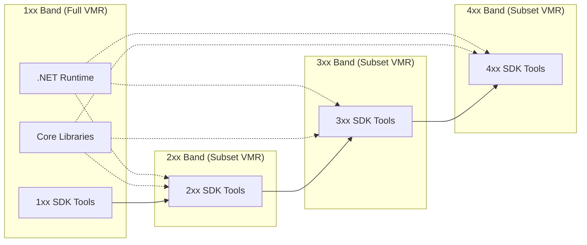
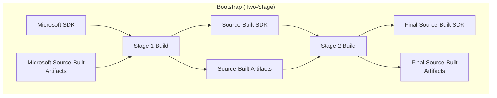
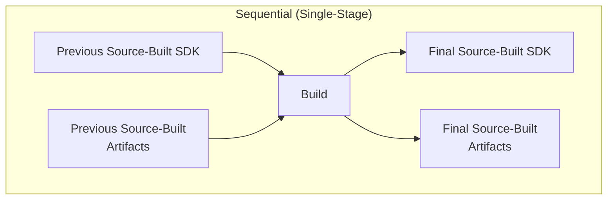
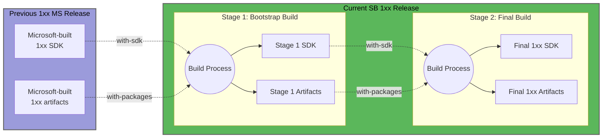
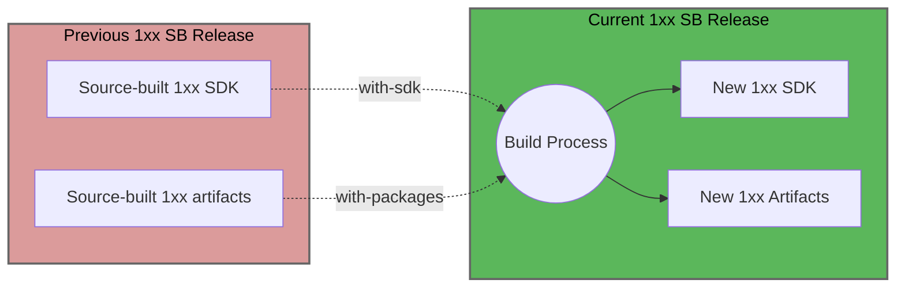
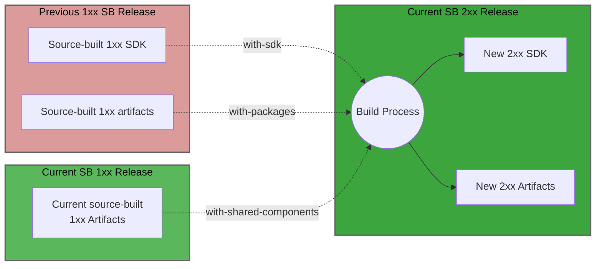
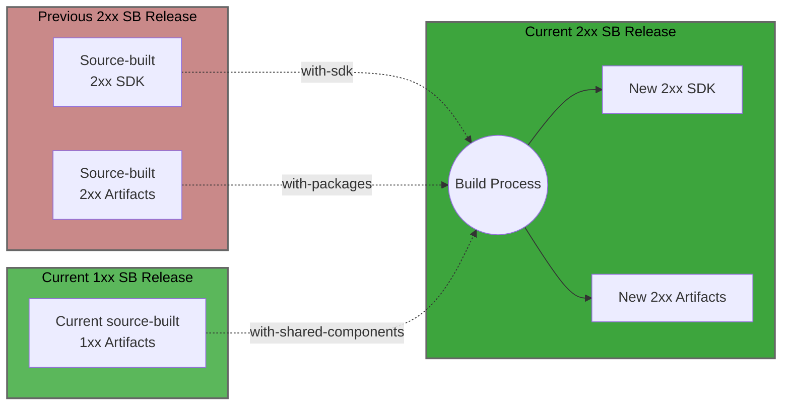
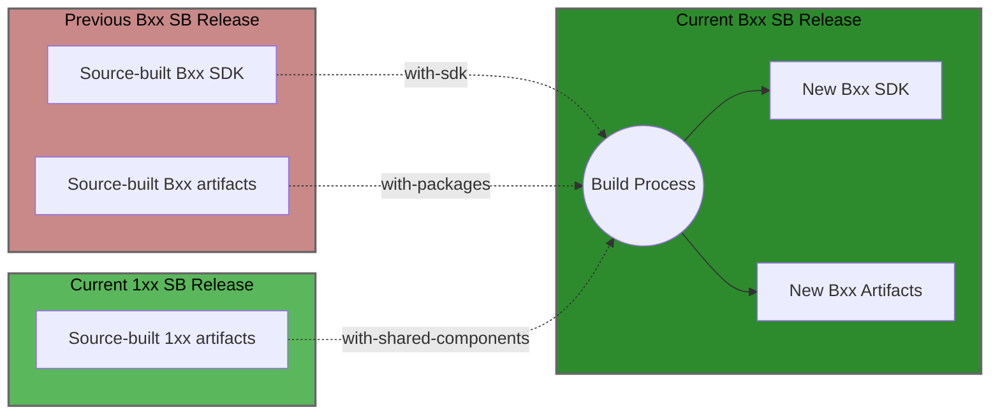
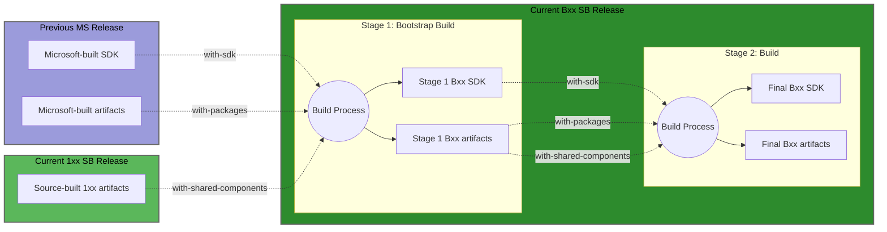

# .NET VMR Feature Band Source Building Guide for Linux Distro Maintainers

This document provides guidance for Linux distribution maintainers on source
building .NET SDK feature band branches of the Virtual Monolithic Repository
(VMR). It covers bootstrapping and ongoing servicing workflows when building
multiple SDK feature bands.

## Table of Contents

- [What are .NET SDK Feature Bands?](#what-are-net-sdk-feature-bands)
- [Key Terminology](#key-terminology)
- [Overview](#overview)
- [Understanding Bootstrap vs Sequential Build](#understanding-bootstrap-vs-sequential-build)
- [Required Build Inputs](#required-build-inputs)
- [Feature Band Characteristics](#feature-band-characteristics)
- [Build Requirements by Feature Band](#build-requirements-by-feature-band)
- [Build Command Arguments](#build-command-arguments)
- [Distro Maintainer Workflows](#distro-maintainer-workflows)
  - [Input Artifacts Summary](#input-artifacts-summary)
  - [1xx Band Servicing](#1xx-band-servicing)
  - [2xx Band Initial Release (N.0.200)](#2xx-band-initial-release-n0200)
  - [2xx Band Servicing (N.0.201+)](#2xx-band-servicing-n0201)
  - [3xx Band Initial Release (N.0.300)](#3xx4xx-band-initial-release-n0b00)
  - [3xx Band Servicing (N.0.301+)](#3xx4xx-band-servicing-n0b01)
  - [2xx/3xx/4xx Bootstrap (N.0.B00+)](#2xx3xx4xx-bootstrap-n0b00)
- [Troubleshooting](#troubleshooting)
- [Poison and Prebuilt Detection](#poison-and-prebuilt-detection)
- [Additional Resources](#additional-resources)

## What are .NET SDK Feature Bands?

.NET SDK feature bands are different versions of the .NET SDK that provide
additional tooling functionality during the servicing lifetime of a .NET major
release. These bands primarily support new Visual Studio scenarios and are
identified by differences in the first digit of the patch numbers in the .NET
SDK version.

Each feature band shares the same .NET runtime but includes different SDK
tooling. For more information, see the [official
documentation](https://learn.microsoft.com/en-us/dotnet/core/releases-and-support#feature-bands-sdk-only).

## Key Terminology

- **VMR** - Virtual Monolithic Repository containing .NET source code
- **N** - Placeholder for the .NET major version number (e.g., `N.0.1xx`
  where `N`=10 for .NET 10)
- **1xx band** - The initial SDK feature band that ships with .NET GA and
  contains the shared runtime components
- **2xx/3xx/4xx bands** - Additional SDK feature bands with enhanced tooling
  that are released sequentially (2xx → 3xx → 4xx)
- **Previously Source-Built (PSB) artifacts** - Artifacts from previous builds
  that provide dependencies but are not redistributed
- **Shared component artifacts** - Shared runtime and foundational components
  from the 1xx band build that are redistributed across feature bands

## Overview

Building .NET SDK feature bands from source follows a two-stage approach:

1. **Build the 1xx band** - This produces the shared .NET runtime and the 1xx
   SDK tooling. The 1xx band contains all runtime components and serves as the
   foundation for other bands.

2. **Build additional bands (2xx, 3xx, etc.)** - These bands contain only the
   SDK tooling components that differ from the 1xx band. They reuse the shared
   runtime from the 1xx build.

Each feature band branch in the VMR contains only the source code that differs
from the 1xx band. Components that don't change between bands are excluded
from the later band branches to avoid confusion and maintenance overhead.



*Dotted lines indicate shared runtime components from the 1xx band; solid
lines show SDK tooling dependencies between bands*

**Note on 3xx and 4xx bands**: The 3xx and 4xx bands follow the same build patterns.
To keep the document more concise, the pattern used by 3xx and 4xx will be
described in a general way that is come to both bands. When `Bxx` is used, it
refers to the feature band in context (e.g. `Bxx` means 3xx in the context of the 
3xx feature band). Similarly, when `(B-1)xx` is used, it refers to the previous
feature band (e.g. `(B-1)xx` means 2xx in the context of the 3xx feature band).

## Understanding Bootstrap vs Sequential Build

### Bootstrap Process (Two-Stage)

Bootstrapping is required when you don't have suitable source-built artifacts
to build a release. It's a two-stage process:

1. **Stage 1**: Use Microsoft-provided source-built artifacts and Microsoft
   SDK to build the target release
2. **Stage 2**: Use the outputs from Stage 1 to rebuild the same release from
   source

The second stage validates that the release can be built using only
source-built components and produces the final artifacts for distribution.



See [Bootstrapping Guidelines](bootstrapping-guidelines.md) for more info.

### Sequential Build (Single-Stage)

When you have appropriate source-built artifacts from previous builds, you can
build directly without bootstrapping. This is the typical workflow for ongoing
releases.



## Required Build Inputs

When building feature bands, you'll work with two types of source-built
artifacts:

### Previously Source-Built (PSB) Artifacts

These are artifacts from previous servicing releases or bootstrap builds:

- Used as build dependencies but not redistributed in outputs
- Come from previous monthly .NET releases (e.g., 8.0.1 artifacts when
  building 8.0.2)
- Subject to [poison detection](leak-detection.md) to ensure no Microsoft
  binaries leak into outputs

### Shared Component Artifacts

These are shared runtime and foundational components from the 1xx band:

- Come from the 1xx band build in the same release cycle
- Can be used as dependencies AND redistributed in outputs
- Include shared runtime and foundational components that all feature bands
  depend on

## Feature Band Characteristics

### 1xx Band (GA/Non-breaking)

The foundational feature band that ships with .NET GA releases:

- **Content**: Contains the complete VMR with .NET runtime, core libraries,
  and SDK tooling
- **Purpose**: Provides the stable runtime foundation that all other bands
  depend on
- **Release cycle**: Follows .NET GA release schedule with monthly servicing
  updates
- **Compatibility**: Non-breaking changes only during servicing
- **Support**: In support for the lifetime of the associated .NET major version

### 2xx Band

SDK tooling band that ships after the 1xx band:

- **Content**: Contains only tooling sources - runtime/core libraries are
  excluded
- **Purpose**: Adds enhanced developer tooling features
- **Release cycle**: Independent of other band releases
- **Dependencies**:
  - Initial release (N.0.200) depends on the latest 1xx release
  - Subsequent releases can depend on previous 2xx releases
  - Always uses shared runtime components from 1xx band
- **Support**: In support alongside 1xx until 3xx is released

### 3xx/4xx Band

Subsequent SDK tooling bands after 2xx band:

- **Content**: Contains only tooling sources - runtime/core libraries are
  excluded
- **Purpose**: Delivers additional SDK features and capabilities
- **Release cycle**: Independent of other band releases
- **Dependencies**:
  - Initial release depends on the latest release of the previous supported feature band
  - Subsequent releases can depend on previous releases of the same feature band
  - Always uses shared runtime components from 1xx band
- **Support**: In support alongside 1xx
  - 3xx becomes unsupported when 4xx is released

## Build Requirements by Feature Band

Each feature band has specific requirements for SDKs and artifacts:

### 1xx Band Build Requirements

- **Bootstrap (any version)**: Two-stage process using Microsoft source-built
  1xx artifacts + Microsoft SDK + script
- **Servicing (N.0.101+)**: Source-built SDK and artifacts from the previous
  1xx release

Note: Only the 1xx SDK is guaranteed to build the shared runtime components

### 2xx Band Build Requirements

- **Bootstrap (any version)**: Two-stage process using Microsoft source-built
  2xx artifacts + Microsoft 2xx SDK + prep script
- **Initial Release (N.0.200)**: Current source-built 1xx artifacts + current
  source-built 1xx SDK
- **Servicing (N.0.201+)**: Source-built SDK and artifacts from the previous
  2xx release + current 1xx artifacts

### 3xx/4xx Band Build Requirements

- **Bootstrap (any version)**: Two-stage process using Microsoft source-built
  Bxx artifacts + Microsoft Bxx SDK + prep script
- **Initial Release (N.0.B00)**: Current source-built 1xx artifacts + current
  source-built (B-1)xx artifacts + current source-built (B-1)xx SDK
- **Servicing (N.0.B01+)**: Source-built SDK and artifacts from the previous
  Bxx release + current 1xx artifacts

### Feature Band Key Points

- Release schedules across bands are not necessarily aligned (unless there is
  a security release in the shared components in which case they will be aligned).
- 1xx band produces the shared runtime that all bands use.
- Only 1xx and at most one other band (2xx, 3xx, or 4xx) are in support at any given
  time.
- The initial release of each feature band depends on the latest release of
  the previous band.
- 3xx and 4xx bands follow identical build patterns; the scenarios documented
  for 3xx apply equally to 4xx with adjusted version numbers.

## Build Command Arguments

Feature band builds make use of these relevant command-line arguments:

- `--with-packages` - Provides PSB artifacts
- `--with-shared-components` - Provides shared component artifacts from 1xx build
- `--with-sdk` - Specifies the SDK to use for building

## Distro Maintainer Workflows

The following sections describe the workflows for different scenarios.

### Input Artifacts Summary

**For 1xx band builds:**

- **[Bootstrap](#1xx-band-bootstrap)**:
  - PSB artifacts: Microsoft-built previous N.0.1xx release
  - SDK: Microsoft-built previous N.0.1xx release
- **[Servicing](#1xx-band-servicing)**:
  - PSB artifacts: Source-built previous N.0.1xx release
  - SDK: Source-built previous N.0.1xx release

**For 2xx band builds:**

- **[Initial release (N.0.200)](#2xx-band-initial-release-n0200)**:
  - Shared component artifacts: Source-built current N.0.1xx release
  - PSB artifacts: Source-built previous N.0.1xx release
  - SDK: Source-built previous N.0.1xx release
- **[Bootstrap (N.0.200+)](#2xx3xx4xx-bootstrap-n0b00)**:
  - Shared component artifacts: Source-built current N.0.1xx release
  - PSB artifacts: Microsoft-built previous N.0.1xx (for bootstrapping N.0.200)
    or N.0.2xx (for bootstrapping N0.0.201+) release
  - SDK: Microsoft-built previous N.0.1xx release
- **[Servicing (N.0.201+)](#2xx-band-servicing-n0201)**:
  - Shared component artifacts: Source-built current N.0.1xx release
  - PSB artifacts: Source-built previous N.0.2xx release
  - SDK: Source-built previous N.0.2xx release

**For 3xx/4xx band builds:**

- **[Initial release (N.0.B00)](#3xx4xx-band-initial-release-n0b00)**:
  - Shared component artifacts: Source-built current N.0.1xx release
  - PSB artifacts: Source-built previous N.0.(B-1)xx release
  - SDK: Source-built previous N.0.(B-1)xx release
- **[Bootstrap (N.0.B00+)](#2xx3xx4xx-bootstrap-n0b00)**:
  - Shared component artifacts: Source-built current N.0.1xx release
  - PSB artifacts: Microsoft-built previous N.0.(B-1)xx release
  - SDK: Microsoft-built previous N.0.(B-1)xx release
- **[Servicing (N.0.B01+)](#3xx4xx-band-servicing-n0b01)**:
  - Shared component artifacts: Source-built current N.0.1xx release
  - PSB artifacts: Source-built previous N.0.Bxx release
  - SDK: Source-built previous N.0.Bxx release

### 1xx Band Bootstrap

For the initial bootstrap of a 1xx band (two-stage process):

```bash
# Clone VMR branch/tag
git clone -b <1xx-release-branch> https://github.com/dotnet/dotnet.git
cd dotnet

# ===
# Stage 1: Build with Microsoft artifacts
# ===

# Downloads Microsoft source-built 1xx artifacts and Microsoft SDK
./prep-source-build.sh

# Build the SDK
./build.sh --source-only

# Extract and store the built SDK and artifacts
tar -ozxf artifacts/assets/Release/dotnet-sdk-*-tar.gz \
  -C /tmp/dotnet/sdk
tar -ozxf artifacts/assets/Release/Private.SourceBuilt.Artifacts.*.tar.gz \
  -C /tmp/dotnet/artifacts

# ===
# Stage 2: Rebuild using stage 1 outputs
# ===

./build.sh --source-only --with-sdk /tmp/dotnet/sdk --with-packages /tmp/dotnet/artifacts

# Final source-built outputs available in artifacts/x64/Release/
```



### 1xx Band Servicing

For ongoing 1xx servicing builds.

Required inputs:

- source-built SDK and artifacts from the previous 1xx release

```bash
git clone -b <1xx-release-branch> https://github.com/dotnet/dotnet.git
cd dotnet

# Build the SDK referencing assets from previous 1xx release
./build.sh --source-only \
  --with-sdk /path/to/source-built-1xx/sdk \
  --with-packages /path/to/source-built-1xx/artifacts

# Final source-built outputs available in artifacts/x64/Release/
```



### 2xx Band Initial Release (N.0.200)

Initial release of the 2xx band.

Required inputs:

- source-built artifacts of the current 1xx release
- source-built SDK artifacts from the previous 1xx release

```bash
git clone -b <2xx-release-branch> https://github.com/dotnet/dotnet.git
cd dotnet

# Build the SDK
./build.sh --source-only \
  --with-sdk /path/to/previous-source-built-1xx/sdk \
  --with-packages /path/to/previous-source-built-1xx/artifacts \
  --with-shared-components /path/to/current-source-built-1xx/artifacts

# Final source-built outputs available in artifacts/x64/Release/
```



### 2xx Band Servicing (N.0.201+)

For ongoing 2xx servicing builds.

Required inputs:

- source-built artifacts of the current 1xx release
- source-built SDK and artifacts from the previous 2xx release

```bash
git clone -b <2xx-release-branch> https://github.com/dotnet/dotnet.git
cd dotnet

# Build the SDK
./build.sh --source-only \
  --with-sdk /path/to/previous-source-built-2xx/sdk \
  --with-packages /path/to/previous-source-built-2xx/artifacts \
  --with-shared-components /path/to/current-source-built-1xx/artifacts

# Final source-built outputs available in artifacts/x64/Release/
```



### 3xx/4xx Band Initial Release (N.0.B00)

For the initial Bxx release.

Required inputs:

- source-built artifacts from the current 1xx release
- source-built SDK and artifacts from the previous (B-1)xx release

```bash
git clone -b <Bxx-release-branch> https://github.com/dotnet/dotnet.git
cd dotnet

# Build the SDK
./build.sh --source-only \
  --with-sdk /path/to/previous-source-built-(B-1)xx/sdk \
  --with-packages /path/to/previous-source-built-(B-1)xx/artifacts \
  --with-shared-components /path/to/current-source-built-1xx/artifacts

# Final source-built outputs available in artifacts/x64/Release/
```

```mermaid
flowchart LR
    subgraph SBPrev2xx["Previous (B-1)xx SB Release"]
        Prev_2xx_SDK[Source-built (B-1)xx SDK]
        Prev_2xx_Art[Source-built (B-1)xx Artifacts]
    end
    
    subgraph SBCurr1xx["Current 1xx SB Release"]
        Curr_1xx_Art[Source-built 1xx artifacts]
    end
    
    subgraph SBCurr3xx["Current Bxx SB Release"]
        Build((Build Process))
        SDK_3xx[New Bxx SDK]
        Art_3xx[New Bxx Artifacts]
    end
    
    Prev_2xx_SDK -.->|with-sdk| Build
    Prev_2xx_Art -.->|with-packages| Build
    Curr_1xx_Art -.->|with-shared-components| Build
    Build --> SDK_3xx
    Build --> Art_3xx
    
    classDef prev2xx fill:#c98989,stroke:#666,stroke-width:2px,color:#000
    classDef curr1xx fill:#5bb75b,stroke:#666,stroke-width:2px,color:#000
    classDef curr3xx fill:#2d8b2d,stroke:#666,stroke-width:2px,color:#000
    class SBPrev2xx prev2xx
    class SBCurr1xx curr1xx
    class SBCurr3xx curr3xx
```

### 3xx/4xx Band Servicing (N.0.B01+)

For ongoing 3xx servicing builds.

Required inputs:

- source-built artifacts from the current 1xx release
- source-built SDK and artifacts from the previous Bxx release

```bash
git clone -b <Bxx-release-branch> https://github.com/dotnet/dotnet.git
cd dotnet

# Build the SDK
./build.sh --source-only \
  --with-sdk /path/to/previous-source-built-Bxx/sdk \
  --with-packages /path/to/previous-source-built-Bxx/artifacts \
  --with-shared-components /path/to/current-source-built-1xx/artifacts

# Final source-built outputs available in artifacts/x64/Release/
```



### 2xx/3xx/4xx Bootstrap (N.0.B00+)

For releases that require bootstrap (two-stage process).

Required inputs:

- source-built artifacts from the current 1xx release

```bash
git clone -b <Bxx-release-branch> https://github.com/dotnet/dotnet.git
cd dotnet

# ===
# Stage 1: Build with Microsoft artifacts
# ===

# Downloads Microsoft-built artifacts and Microsoft SDK
./prep-source-build.sh

# Build the SDK referencing assets from current 1xx release
./build.sh --source-only --with-shared-components /path/to/source-built-1xx/artifacts

# Extract and store the built Bxx SDK and artifacts
tar -ozxf artifacts/assets/Release/dotnet-sdk-*-tar.gz \
  -C /tmp/dotnet/sdk
tar -ozxf artifacts/assets/Release/Private.SourceBuilt.Artifacts.*.tar.gz \
  -C /tmp/dotnet/artifacts

# ===
# Stage 2: Rebuild using stage 1 outputs
# ===

./build.sh --source-only \
  --with-sdk /tmp/dotnet/sdk \
  --with-packages /tmp/dotnet/artifacts \
  --with-shared-components /tmp/dotnet/artifacts

# Final source-built outputs available in artifacts/x64/Release/
```



## Troubleshooting

**Error**: `Shared components cannot be provided as input to a build which
produces shared components`

- **Explanation**: You're building the 1xx band (`main` or `N.0.1xx` branch)
  and providing shared component artifacts as input. The 1xx band produces
  shared components, so it doesn't consume them as inputs.
- **Resolution**: Exclude the `--with-shared-components` parameter from the
  `build.sh` script.

**Error**: `Shared components must be provided as input to a build which does
not produce shared components`

- **Explanation**: You're building a 2xx, 3xx, or 4xx band and not providing
  shared component artifacts as input. These bands require shared components
  from the 1xx band because they provide the necessary runtime and
  foundational components for the SDK.
- **Resolution**: Include the `--with-shared-components` parameter for the
  `build.sh` script.

## Poison and Prebuilt Detection

The poison detection system treats shared component and PSB artifacts
differently:

- **PSB artifacts**: Subject to poison detection to prevent Microsoft binaries
  in output
- **Shared component artifacts**: Not poisoned since they're shared components
  from the same source-build iteration
- **Prebuilt detection**: Shared component inputs are not considered prebuilts

## Additional Resources

- [.NET Feature Bands](https://learn.microsoft.com/en-us/dotnet/core/releases-and-support#feature-bands-sdk-only)
- [Source-Build Documentation](../README.md)
- [VMR Managing SDK Bands](https://github.com/dotnet/dotnet/blob/main/docs/VMR-Managing-SDK-Bands.md)
