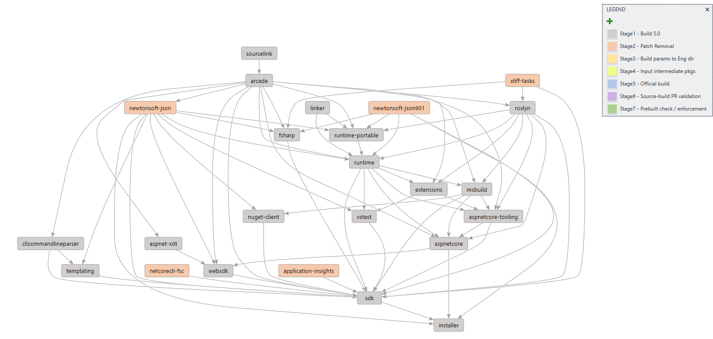

# Source-build 5.0 Implementation Plan

To get each repo building with the new source-build 5.0 plan, [Arcade-Powered Source-Build](https://github.com/dotnet/source-build/tree/release/3.1/Documentation/planning/arcade-powered-source-build), the following stages will be accomplished.  Below, the repos are placed in a table representing the earliest dependencies are available and work can begin.  Stages can be completed in parallel, but stage 4 may depend on output from stage 6 from previous repos.  The following graph and table will be used to track progress for each repo.

> 
> [source (img/implementation-plan-graph.dgml)](img/implementation-plan-graph.dgml)

| Tier | Repo | Owner | (Stage 1) Build from source - 5.0 | (Stage 2) Input intermediate packages available | (Stage 3) Merge patches & local build infra into dev branch | (Stage 4) Merge CI, generate mock official build | (Stage 5) Validate & merge dev branch into 5.0 | (Stage 6) Prebuilt baseline enforcement |
| --- | --- | --- | :---: | :---: | :---: | :---: | :---: | :---: |
| sbrp | Source-build-reference-packages | [Dan Seefeldt](https://github.com/dseefeld) | ✔️ | ✔️ | ⏱ [#1715](https://github.com/dotnet/source-build/issues/1715) | ✔️ | ✔️ | |
| Tools | sourcelink | [Tomas Matousek](https://github.com/tmat) | ✔️ | | | | | |
| Tools | arcade | [Mark Wilkie](https://github.com/markwilkie) | ✔️ | | | | | |
| 1 | application-insights | [Reiley Yang](https://github.com/reyang) | ✔️ | | | | | |
| 1 | aspnet-xdt | [Vijay Ramakrishnan](https://github.com/vijayrkn) | ✔️ | | | | | |
| 1 | newtonsoft-json | [Chris Rummel](https://github.com/crummel) | ✔️ | | | | | |
| 1 | netcorecli-fsc | [Chris Rummel](https://github.com/crummel) | ✔️ | | | | | |
| 1 | newtonsoft-json901 | [Chris Rummel](https://github.com/crummel) | ✔️ | | | | | |
| 1 | xliff-tasks | [William Li](https://github.com/wli3) | ✔️ | | | | | |
| 1 | clicommandlineparser | [Sarah Oslund](https://github.com/sfoslund) | ✔️ | | | | | |
| 1 | roslyn | [Fred Silberberg](https://github.com/333fred) | ✔️ | | | | | |
| 2 | linker | [Dan Seefeldt](https://github.com/dseefeld) | ✔️ | | | | | |
| 2 | runtime | [Jared Parsons](https://github.com/jaredpar) | ✔️ | | | | | |
| 2 | msbuild | [Ben Villalobos](https://github.com/BenVillalobos) | ✔️ | | | | | |
| 2 | NuGet.Client | [Fernando Aguilar Reyes](https://github.com/dominoFire) | ✔️ | | | | | |
| 2 | templating | [Jose Aguilar](https://github.com/donJoseLuis) | ✔️ | | | | | |
| 3 | aspnetcore | [John Luo](https://github.com/JunTaoLuo) | ✔️ | | | | | |
| 3 | websdk | [Vijay Ramakrishnan](https://github.com/vijayrkn) | ✔️ | | | | | |
| 4 | sdk | [Sarah Oslund](https://github.com/sfoslund) | ✔️ | | | | | |
| 4 | vstest | [Jakub Jares](https://github.com/nohwnd) | ✔️ | | | | | |
| 4 | fsharp | [Brett Forsgren](https://github.com/brettfo) | ✔️ | | | | | |
| 5 | installer | [Sarah Oslund](https://github.com/sfoslund) | ✔️ | | | | | |

| Status | Description |
| --- | --- |
| ✔️ | Complete |
| ⏱ | In progress |
| ❗ | At Risk |

## Stage descriptions:
  - **(1) Build from source 5.0** – Get repo building from source with 5.0 source in dotnet/source-build.
  - **(2) Input intermediate packages available** – Indicates upstream intermediate packages are available, and work on this repo can begin.
  - **(3) Merge patches & local build infra into dev branch** – Repo owner has created source-build dev branch.  Move all source-build specific build parameters from `/repos/<reponame>.proj` in source-build repo to repo `/eng` directory and add repo-specific patches into source-build dev branch.
  - **(4) Merge CI, generate mock official build** – PR validation and Official Build CI jobs added to source-build dev branch and run to generate intermediate package for repo. 
  - **(5) Validate & merge dev branch into 5.0** – Build logs and intermediate package reviewed and validated by source-build team.  Source-build changes are live for repo in 5.0 branch.  Build source-built intermediate packages in official build.
  - **(6) Prebuilt baseline enforcement** – Prebuilt checks enforcment enabled in PR validation builds.  Builds fail if new prebuilts are introduced.
