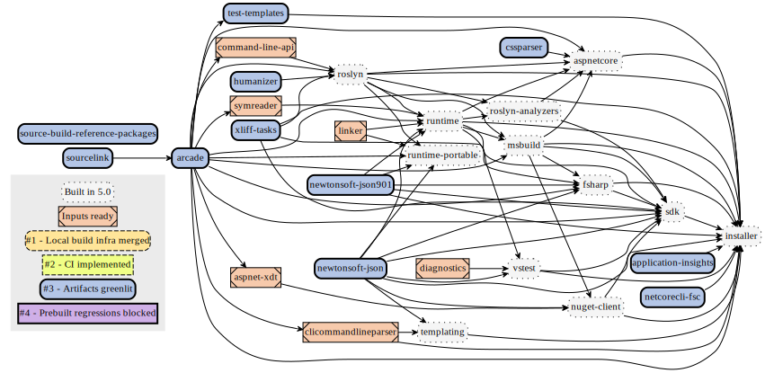

# Arcade-powered source-build implementation plan

To get each repo building with the new source-build sustainability plan, [Arcade-Powered Source-Build](./README.md), each repo will go through several stages. Some stages have dependencies on upstream repos, so this process will be completed in dependency order with some exceptions.

Below, the repo status is in a graph to show the dependencies and make it easy to tell which repos are ready to work on. There's also a table, for searchable and more detailed status. These will both be kept up to date.

>   
> [source (img/implementation-plan-graph.dot)](img/implementation-plan-graph.dot)

| Tier | Repo | Owner | Input intermediate packages available | (Stage 1) Local build infra merged | (Stage 2) CI implemented | (Stage 3) Artifacts greenlit | (Stage 4) Prebuilt regressions blocked |
| --- | --- | --- | :---: | :---: | :---: | :---: | :---: |
| sbrp | Source-build-reference-packages | [Dan Seefeldt](https://github.com/dseefeld) | ✔️ | ✔️ | ✔️ | ✔️ | |
| Tools | sourcelink | [Tomas Matousek](https://github.com/tmat) | ✔️ | ✔️ | ✔️ | ✔️ | |
| Tools | arcade | [Mark Wilkie](https://github.com/markwilkie) | ✔️ | ✔️ | ✔️ | ✔️ | |
| 1 | *application-insights*1 | ? | ✔️ | ✔️ | ✔️ | ✔️ | |
| 1 | *cssparser*1 | ? | ✔️ | ✔️ | ✔️ | ✔️ | |
| 1 | *humanizer*1 | ? | ✔️ | ✔️ | ✔️ | ✔️ | |
| 1 | *netcorecli-fsc*1 | [Chris Rummel](https://github.com/crummel) | ✔️ | ✔️ | ✔️ | ✔️ | |
| 1 | *newtonsoft-json*1 | [Chris Rummel](https://github.com/crummel) | ✔️ | ✔️ | ✔️ | ✔️ | |
| 1 | *newtonsoft-json901*1 | [Chris Rummel](https://github.com/crummel) | ✔️ | ✔️ | ✔️ | ✔️ | |
| 1 | aspnet-xdt | [Vijay Ramakrishnan](https://github.com/vijayrkn) | ✔️ | | | | |
| 1 | clicommandlineparser | [Sarah Oslund](https://github.com/sfoslund) | ✔️ | | | | |
| 1 | command-line-api | [?](https://github.com/) | ✔️ | | | | |
| 1 | diagnostics | ? | ✔️ | | | | |
| 1 | roslyn | [Fred Silberberg](https://github.com/333fred) | | | | | |
| 1 | symreader | [Tomas Matousek](https://github.com/tmat) | ✔️ | | | | |
| 1 | test-templates | ? | ✔️ | ✔️ | ✔️ | ✔️ | |
| 1 | xliff-tasks | [Mark Wilkie](https://github.com/markwilkie) | ✔️ | ✔️ | ✔️ | ✔️ | |
| 2 | linker | [Marek Safar](https://github.com/marek-safar) | ✔️ | | | | |
| 2 | msbuild | [Ben Villalobos](https://github.com/BenVillalobos) | | | | | |
| 2 | NuGet.Client | [Fernando Aguilar Reyes](https://github.com/dominoFire) | | | | | |
| 2 | runtime | [Jared Parsons](https://github.com/jaredpar) | | | | | |
| 2 | templating | [Vlada Shubina](https://github.com/vlada-shubina) | | | | | |
| 3 | roslyn-analyzers | [Jonathon Marolf](https://github.com/jmarolf) | | | | | |
| 4 | aspnetcore | [John Luo](https://github.com/JunTaoLuo) | | | | | |
| 4 | websdk | [Vijay Ramakrishnan](https://github.com/vijayrkn) | | | | | |
| 5 | fsharp | [Brett Forsgren](https://github.com/brettfo) | | | | | |
| 5 | sdk | [Sarah Oslund](https://github.com/sfoslund) | | | | | |
| 5 | vstest | [Jakub Jares](https://github.com/nohwnd) | | | | | |
| 6 | installer | [Sarah Oslund](https://github.com/sfoslund) | | | | | |

| Status | Description |
| --- | --- |
| ✔️ | Complete |
| ⏱ | In progress |
| ❗ | At Risk |

> 1 — Source will be maintained in central dotnet/source-build repo. It is not feasible to add full arcade-powered source-build infrastructure in some cases.

## Stage descriptions:
  - **(1) Local build infra merged**
    - (Source-build) Submit PR introducing local build infra. May include `.patch` files.
    - (**Repo team**) Review PR and merge.
      - Merging into main/master strongly preferred.
      - If a dev branch is created, the repo team must merge it into main/master before ending stage (3).
  - **(2) CI implemented** (PR + Official)
    - (**Repo team**) Submit PR adding source-build CI jobs and merge.
      - Let us know, and send us a link to an official build that includes the changes. We will start on (3).
    - *Async (**Repo team**) Incorporate `.patch` files into repo.*
      - *High impact: if these patch files have conflicts, CI fails.*
  - **(3) Artifacts greenlit** for downstream usage
    - (Source-build) Validate "intermediate nupkg" artifact and logs.
    - (Source-build) Preliminary check for unexpected prebuilt usage.
    - (Source-build + **repo team**) Fix up problems if found.
  - **(4) Prebuilt regressions blocked**
    - (Source-build) Submit PR enabling prebuilt baseline enforcement.
      - Prebuilt binary usage is expected because this is a "production build", not a "tarball build".
      - Prebuilt usage baseline enforcement prevents prebuilt regression.
      - We will only do this once enforcement errors are actionable.
    - (**Repo team**) Review PR and merge.
