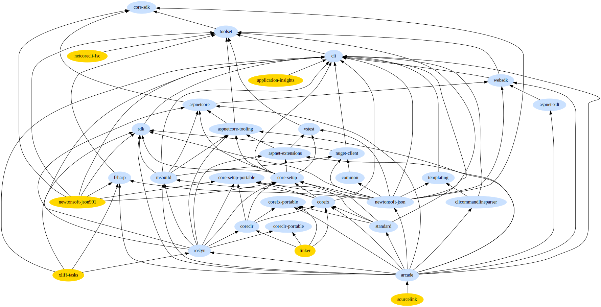

# Incremental improvements to source-build in official builds

We can add official source-build to repos one at a time. This incrementally
creates a tree of cached builds.

## Dependency leaves

The following diagram is the source-build intermediate output flow in 3.1, with
leaf nodes colored gold and the Core-SDK (dotnet/installer) product at the top:

> 
> [source (img/official-leaves.dot)](img/official-leaves.dot)

To build up the tree of cached builds, source-build must be distributed amongst
the repos. We should do this by repeatedly adding source-build functionality to
leaf repos (removing completed repos from the graph) until every repo runs
source-build.

> Note: the .NET Core build does have circular dependencies, so technically no
> repos are pure leaves. For example, compiling C# in the leaves above requires
> a .NET Core SDK toolset. Source-build cuts the dependencies as shown above and
> uses a bootstrap flow to avoid prebuilts. The bootstrap flow is out of the
> scope of this incremental official build doc. See ["The speculative SDK" in
> README.md](README.md#the-speculative-sdk).

## Leaf first

Reasons to implement ArPow in leaves first:

* This most closely resembles an actual source-build. Either the repo has no
  dependencies, or it gets all its dependencies from upstream ArPow builds.
* If there are differences in the source-built artifacts from the upstreams,
  they are exercised.
* Fewer or no prebuilts are used.

## Exceptions to leaf-first

Some repos have very high impact to source-build and may introduce unexpected
problems, such as dotnet/runtime. It is useful to implement ArPow in these repos
even if upstreams aren't ready yet. For example, working on dotnet/runtime
before it was a leaf exposed issues with artifact size.

This makes sense for dotnet/runtime, but not for dotnet/aspnetcore. The behavior
of aspnetcore depends a lot on the non-portable source-build RID, and needs
artifacts to be available specifically for that RID. Building aspnetcore for
`centos.7-x64` requires runtime artifacts with that non-portable RID, which are
only built by source-build.
