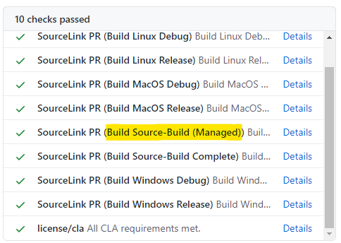

# CI onboarding

ArPow (arcade-powered source-build) needs to run during official builds to
create source-build [intermediate nupkg]s for the downstream repos that will
consume them. ArPow should also run in PR validation builds, to prevent
regression in the ArPow flow.

The ArPow implementation can be activated with a single flag in the ordinary
Arcade SDK jobs template for easy consumption. If a repo can't simply use the
Arcade SDK jobs template, more granular templates are also available.

See <https://github.com/dotnet/arcade/tree/master/eng/common/templates> for the
current template source code. The inline comments in the `parameters:` section
in those files are the most up to date docs, maintained with higher priority
than this general onboarding doc.

## `eng/common/templates/jobs/jobs.yml` opt-in switch

The simplest way to onboard. This approach applies if the repo already uses the
`eng/common/templates/jobs/jobs.yml` template.

To opt in:

### 1: Set `enableSourceBuild: true`

Set `enableSourceBuild: true` in the template parameters.

This should look something like
[this sourcelink implementation:](https://github.com/dotnet/sourcelink/blob/dfe619dc722be42d475595c755c958afe6177554/azure-pipelines.yml#L40)

```yaml
stages:
- stage: build
  displayName: Build
  jobs:
  - template: /eng/common/templates/jobs/jobs.yml
    parameters:
      enablePublishUsingPipelines: true
      enablePublishBuildArtifacts: true
      enablePublishBuildAssets: true
      enableSourceBuild: true
      artifacts:
        publish:
          artifacts: true
          manifests: true
```

### 2: Specify platforms (if repo is not managed-only)

A repo is managed-only if `eng/SourceBuild.props` contains
`<SourceBuildManagedOnly>true</SourceBuildManagedOnly>`. If this is true, this
step is not necessary. Otherwise, specify `sourceBuildParameters` in the
`jobs.yml` template's parameters like this:

```yaml
sourceBuildParameters:
  platforms:
  - name: 'Centos71_Portable'
    container: 'mcr.microsoft.com/dotnet-buildtools/prereqs:centos-7-3e800f1-20190501005343'
  - name: 'MacOS_Portable'
    pool: { vmImage: 'macOS-10.14' }
  - name: 'Centos71'
    nonPortable: true
    container: 'mcr.microsoft.com/dotnet-buildtools/prereqs:centos-7-3e800f1-20190501005343'
  - name: 'Centos8'
    nonPortable: true
    container: 'mcr.microsoft.com/dotnet-buildtools/prereqs:centos-8-daa5116-20200325130212'
  - name: 'Debian9'
    nonPortable: true
    container: 'mcr.microsoft.com/dotnet-buildtools/prereqs:debian-stretch-20200918130533-047508b'
  - name: 'Fedora30'
    nonPortable: true
    container: 'mcr.microsoft.com/dotnet-buildtools/prereqs:fedora-30-38e0f29-20191126135223'
  - name: 'Fedora32'
    nonPortable: true
    container: 'mcr.microsoft.com/dotnet-buildtools/prereqs:fedora-32-20200512010618-163ed2a'
  - name: 'MacOS'
    nonPortable: true
    pool: { vmImage: 'macOS-10.14' }
  - name: 'Ubuntu1804'
    nonPortable: true
    container: 'mcr.microsoft.com/dotnet-buildtools/prereqs:ubuntu-18.04-20200918145614-047508b'
```

### End result

Submit the changes above in a PR. The jobs (or job, if managed-only) are
automatically be added to CI in the existing pipeline alongside existing jobs,
with a name like `Build Source-Build (<Platform>)`:



Once this PR works, run a mock official build (AKA "validation build") in your
official build definition. The usual workflow is to push a `dev/<your
alias>/arpow` branch to the AzDO repo and then queue a build on that branch.
This makes sure that merging the PR won't immediately break the official build:
`enableSourceBuild: true` does add job(s) to the official build, not just PR
validation.

If the PR is green, but merging it produces red PR or Official builds,
immediately let the source-build team know about the failure and revert the
source-build PR to unblock dev work.


# Advanced: granular templates

If the repo doesn't use the basic Arcade jobs template, or has advanced job
templating infra built on top of the Arcade jobs template, the simple
`enableSourceBuild` flag might not work out. There are a few more granular
templates to use in this case.

Look at the documentation in each YAML file itself to figure out how to use it
properly, and if it fits the scenario. This list is only an overview.

## `eng/common/templates/jobs/source-build.yml`

This is one level deeper than `eng/common/templates/jobs/jobs.yml`. It is a
`jobs` template that produces just the set of source-build jobs based on the
specified `platforms`. Or, just one job with the default platform, if
managed-only.

## `eng/common/templates/job/source-build.yml`

This template defines a single `job` that runs source-build on a specified
platform.

## `eng/common/templates/steps/source-build.yml`

This template defines the build `steps` for a single source-build job. This is
the most granular template, and may be useful if some repo-specific preamble or
cleanup steps are required, or if the repo already has job matrix templates and
this just happens to fit in nicely.


# Official build publishing

Publishing [intermediate nupkg]s in the official build is handled by the
standard Arcade publish infrastructure, which should already be set up in the
repo. The source-build steps handle uploading the [intermediate nupkg] to the
pipeline in the standard way that Arcade will detect and publish.


[intermediate nupkg]: https://github.com/dotnet/source-build/blob/master/Documentation/planning/arcade-powered-source-build/intermediate-nupkg.md
