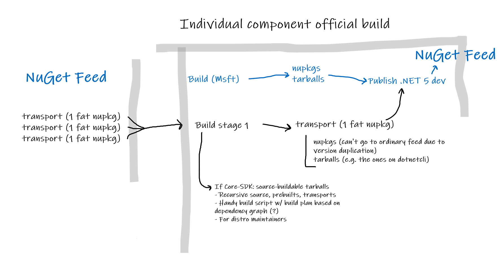
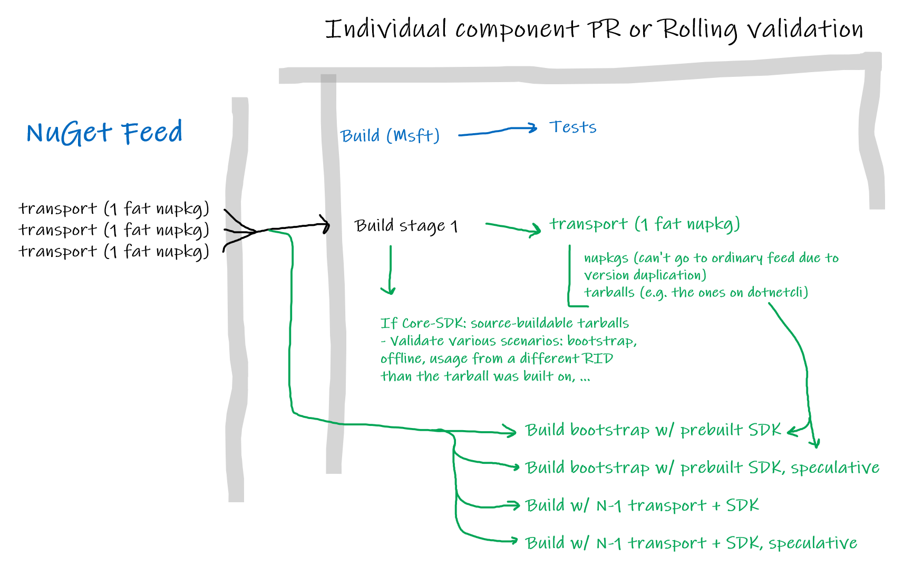

# Source-build's place in a build pipeline

For each repo, source-build must occur in the same official build pipeline that
produces the Microsoft product. This is needed to guarantee the version is the
same and source-built intermediates are available for uptake by downstream
repos.

## Official build

>   
> Blue: Existing  
> Black: Source-build additions.

In official builds, it is important for source-build to be reliable, and not
extend the build time. This means only the necessary steps are performed to
produce the source-build intermediates: minimal to no validation.

The source-build job produces artifacts that are published by the Arcade stages,
like any other artifacts. This will be facilitated by yaml templates in Arcade,
but may require action for each repo to add.

The official build also generates source-buildable tarballs for distro
maintainers, for quick and easy access. These are only needed for the Core-SDK
repo in particular. A full SDK is necessary to be buildable from source via the
bootstrap flow, so there is no significant benefit to producing tarballs in
other official builds.

## PR validation and rolling builds

>   
> Blue: Existing.  
> Black: Basic source-build. Always validate.  
> Green: Extra validation steps (necessary coverage per repo varies).

There are a variety of extra ways to validate source-build. For example,
speculatively building an SDK with the current PR's changes (see
[speculative-build.md](speculative-build.md)), testing the bootstrap flow, etc.

Depending on the value each type of coverage adds to a specific repo, the extra
validation steps need to be configured. They may change depending on the risk of
certain breaks per repo, the state of the release cycle, the set of changed
files, or manual contributor request. For example, a `master` branch is likely
to hit API breaks frequently and not work speculatively, but a servicing branch
may find value in always confirming there are no such breaks.

For rolling builds and PR validation, there may be extra pipelines to run these
steps, to avoid interfering with dev workflows.
