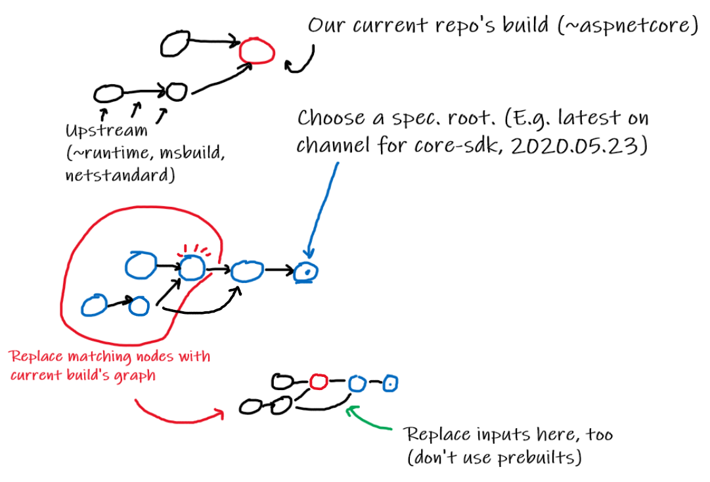
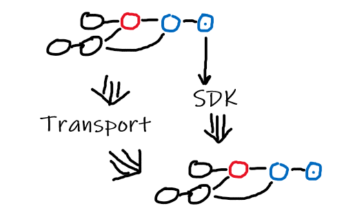
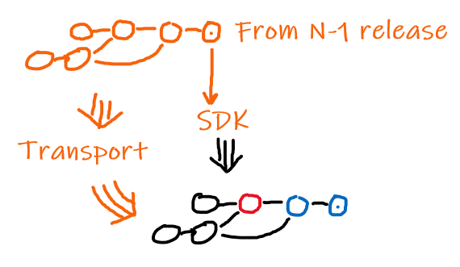

# Speculative build: what would an SDK look like with my changes?

As a dev working on a repo upstream from the SDK, it would be desirable to be
able to build a full SDK that incorporates my changes to see if the SDK's
behavior is changed as expected. It is also convenient to test changes in a full
end-to-end environment.

This has additional uses in the context of source-build. In order to build from
source, we need to be able to bootstrap: build a .NET Core SDK, then build the
entire product again using that .NET Core SDK. Without speculatively building an
SDK, bootstrapping can only be tested in the Core-SDK repository. In some cases,
this is too late to actually fix any problems that are encountered. We need to
push validation for this scenario as far upstream as we can.

Speculative builds are complex. They have been considered before for the
Microsoft build, but haven't been done. It may be significantly easier to do in
source-build, because the entire build can happen on a single machine, rather
than every supported platform (requiring transporting artifacts across
machines).

## How to orchestrate a speculative build

> 

The red circle is the current build. For example, dotnet/aspnetcore on `master`.
The black circles are the builds that were used for intermediates.

First, we need to choose a speculative root build. We choose Core-SDK because it
produces the SDK, and the latest version because it's most likely what we want
to test against. This results in the blue graph. Note that because we have to
make a choice here, there are many possible speculative builds we could perform,
and they might not all work!

Then, we replace all the nodes in the speculative root graph with our local
build graph nodes, based on repository identity. This forms the third graph in
the diagram.

Finally, we rebuild the remaining nodes in the speculative graph, using our
local build outputs. This gives us a speculative SDK as an output.

## Validation: speculative bootstrap

>   
> (The big arrow means *from* and/or *to* many nodes.)

We can use the output SDK and intermediates from our bootstrap build to try to
build the product again, using the same set of repositories/commits. If this is
successful, we have validated the bootstrap build scenario.

## Validation: speculative N-1

>   
> (The big arrow means *from* and/or *to* many nodes.)

If we instead use the output SDK and intermediates from an N-1 build, instead of
building the local speculative graph, we validate the N-1 scenario.
