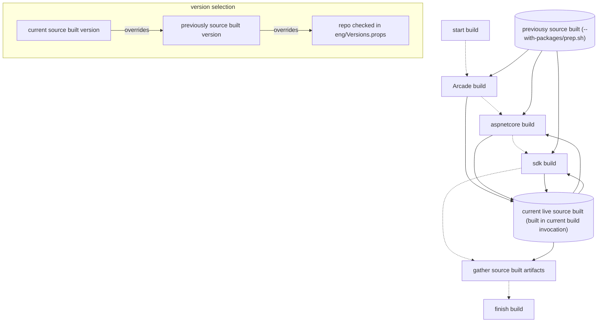
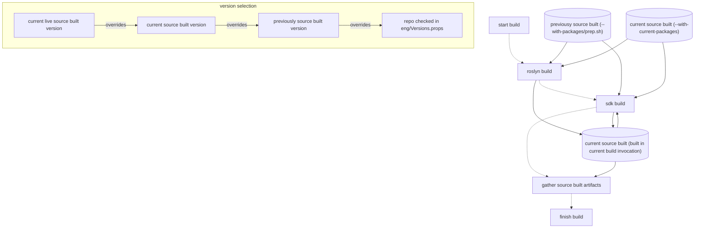

# Source-Build Support for Multiple SDKs

This document serves as the design planning document for how .NET source build will support multiple SDK feature bands. More generally, this support could be described as "partial VMR support". This is the implementation plan for https://github.com/dotnet/arcade/blob/main/Documentation/UnifiedBuild/VMR-Managing-SDK-Bands.md.

## Terminology for this document

- **VMR** - Virtual Monolithic Repository - A projection of the sources of a set of input repo and branch combinations onto another repository.
- **SDK Feature Bands** - SDK functionality, especially around tooling, may evolve signficantly during the servicing lifetime of a .NET major release. This evolution is primarily to support new Visual Studio scenarios. To support this, .NET uses a series of SDK "bands" that correspond to VS releases and the .NET runtime GA release. They are denoted by diferences in the first digit of the patch numbers of the .NET SDK. All patch numbers have 3 digits. Fore more information, please see [official documentation](https://learn.microsoft.com/en-us/dotnet/core/releases-and-support#feature-bands-sdk-only).
- **Component** - A logical collection of sources in a VMR, mapped from an input source repo, which build together to produce a set of binaries that relate in functionality. Examples include [runtime](https://github.com/dotnet/dotnet/tree/main/src/runtime), [roslyn](https://github.com/dotnet/dotnet/tree/main/src/roslyn) or [installer](https://github.com/dotnet/dotnet/tree/main/src/installer).
- **Previously source-built (PSB)** - Artifacts from a previous servicing/preview iteration, or from a bootstrap build. These may be used when building the current dotnet VMR branch, but may not be bundled into any output.

## Overview and General Approach

The general approach to supporting more than one SDK band is to **not** view the build of additional SDK feature bands as being any different from any other source build. Each build of the product combines a set of inputs (previously source-built artifacts + source) to produce a set of outputs that can ship to customers. When building two completely different major versions of .NET, the set of inputs is different (e.g. different source, 6.0 SDK vs. 7.0 SDK). Some of the previously source-built artifacts come from .NET, some may come from the source-built package ecosystem (e.g. icu or clang/llvm). If a repo were to be eliminated from the input sources, the binaries previously built from those sources would now need to come from previously-source built binaries.

The primary restriction on building multiple SDK feature bands is that they must not differ in the shared runtimes. For N bands, there must be a single runtime artifact. Thus, we can view a source-build of N SDK feature bands as:
- As a single build of one runtime, producing a set of source-built outputs and **then**
- Building N SDK feature bands **using**
- The *outputs* of the runtime build combined with additional previously source-built artifacts (e.g. a matching band SDK, required tools and libraries) and source, to produce N SDK feature bands that meet source-build requirements.

The runtime build requires a 1xx band SDK to build **and** redistributes functionality from tooling that ships in the 1xx band (e.g. it has dependencies on roslyn and roslyn-analyzers). Furthermore, most changes to a .NET major version occur when only one SDK band exists. Therefore it makes practical sense at this point to include the source of the 1xx SDK and the shared runtime in the same dotnet VMR branch, and to produce all artifacts related to 1xx, including the runtime, in its build. *Newer bands will be branches of the dotnet VMR that contain **only** the components that **differ** from the 1xx band.* Only those components that differ. When building the newer band, the outputs of the 1xx build would be fed into the newer band build, in a similar manner as previously source built artifacts are today. If the source for a component does not exist in the dotnet VMR, it is simply not built, and obviously no outputs would be produced for that component. Thus any downstream dependencies would be forced to use the versions provided by input source built artifacts, typically from the 1xx source build. If no such version exists, then the input would fail to be found or restored from online sources and be reported as a prebuilt.

This approach fits naturally into the source-build methodology. Generally, additional SDK feature bands may be represented as "subsetted dotnet VMRs", since use of a subsetted dotnet VMR is not restricted to SDKs only.

### Conceptual splitting of 'previously source-built' artifact types

Today, the term "previously source-built artifacts' refers to those artifacts that were built in a previous product build iteration, typically from the previous month. For example, they would refer to the outputs of 8.0.1's build, when building 8.0.2. When building a subsetted dotnet VMR, two sets of input sets of source-built artifacts are required. While similar in some ways, they should be kept distinct. They are referred to as:

- **Previously source-built (PSB)** - Artifacts from a previous servicing/preview iteration, or from a bootstrap build. These may be used when building the current dotnet VMR branch, but may not be bundled into any output.
- **Current source-built (CSB)** - Artifacts just built, e.g. from a 1xx dotnet VMR build. These may be used **and** bundled into the build outputs, since logically they are from the same source-build iteration.

### Supported input artifact combinations and validation thereof

Not all toolsets can be used to build all dotnet VMR branches. SDK feature bands are driven by VS development, which moves forward between .NET releases. Those components of the .NET SDK introduce new functionality, which may require support from the SDK. Prior to the release of the corresponding SDK feature band, components of newer SDKs ocassionally take dependencies on SDK features introduced in the same band, and ocassionally deficiences in older SDK bands may require SDK upgrades. Therefore, it is possible that the 1xx SDK will not successfully build *all* Nxx+ bands from the same .NET major version. This may mean a bootstrap of the initial release of a new non-1xx SDK band. This is an unfortunate reality.

To set expectations and reduce potential distro maintainer pain, the following statements are made:

- The N.0.1xx dotnet VMR branch containing the runtime (1xx) is only gauranteed to build with the 1xx SDK feature band.
- A SDK feature band (e.g. 2xx) *may* be buildable with an older band, typically the 1xx band. However this is not gauranteed. E.g. `8.0.200` may be buildable with `8.0.103`.
- A newer SDK feature band (e.g. 2xx) will *always* be able to build itself. E.g. `8.0.200` will be able to build `8.0.200`. `8.0.105` can build `8.0.105`.
- A new release of an SDK feature band will *always* be buildable using the previous release of the same feature band. E.g. `8.0.201` will be buildable with `8.0.200`, and `8.0.102` will be buildable with `8.0.101`.

From these statements. we can deduce that the initial release of a newer band (n00) may require a bootstrap, or may be buildable using an older band.

To avoid confusion, Microsoft will:

- Document the set of supported build combinations, including required inputs for all active SDK feature bands. This provides a guide for distro maintainers.
- Validate those supported build combinations.
- Validate 'stage2' builds (that a new SDK can build itself).

## Changes required for the source-build infrastructure

This section details changes to the source build infrastructure to support building of subsetted dotnet VMRs.

### Scripting changes

Since conceptually CSB and PSB inputs are different, the scripting should reflect this. Furthermore, since NuGet and non-NuGet archives are treated similarly within the source-build infrastructure, we should take this opportunity to make changes to the names of existing switches:

- `--with-packages` becomes `--with-previous-artifacts`, reflecting that it represents only previously source built artifacts that may be used in the build, but not redistributed with outputs. When poisoning is enabled, this set is poisoned. `--with-previous-artifacts` should be viewed as functionally equivalent to `--with-packages`
- `--with-current-artifacts` - This switch is added. It points to a directory that contains input NuGet and non-NuGet assets that may be redistributed in the current build. Typically this set would come from the 1xx build.

In addition, we should add a script that prepares the input artifacts for the build of a particular dotnet VMR branch, given a set of input directories from other builds/other previously source built artifacts. See [below](#what-artifacts-should-be-passed-with---with-artifacts--with-packages) for an explanation of the input artifacts.

#### Improvements to input artifact handling

`--with-previous-packages`/`--with-packages` takes an input directory. With this effort, the infrastructure should be changed to allow `--with-previous-artifacts` and `--with-current-artifacts` to take a tarball as input, in addition to a directory. The build scripting would extract a tarball to a temporary location.

### Changes to PackageVersion.props flow

When determining what version of a package or asset that a component should build against, there are 3 distinct sets in source-build today, listed in order of precedence from highest to lowest:

- 1. A version just produced by a component built earlier in the build (if available).
- 2. A version in the previously source-built packages (if available).
- 3. The version in the checked in `Versions.props` for a repo.

With the addition of a new input set (CSB), we now have an additional set. Changes should be made such that a PackageVersions.props file is generated for this new set, and is imported in the correct place based on its precedence.

- 1. A version just produced by a component built earlier in the build (if available).
- 2. A version in the current source-built packages (if available).
- 3. A version in the previously source-built packages (if available).
- 3. The version in the checked in `Versions.props` for a repo.

### Filtering builds of components

The dotnet VMR defines a set of projects (under `repo-projects`) that correspond to each component of the build. These projects also define a build dependency graph of these components via the `RepositoryReference` ItemGroup. *Note: there are a few projects that do not correspond directly to a component, but instead serve as general join points in the build graph.*. Source build invokes a root build (`dotnet.proj`), which evaluates the dependency graph and invokes the MSBuild task on dependent projects. To avoid maintenance complexity, we should avoid altering this dependency graph or removing project files when a component should not be built. Instead, it should simply be filtered out and ignored as if the node in the graph was inactive.

When filtering out components, we do not want to build a filtered subproject at all. `AfterTargets=Build`, `BeforeTargets=Build` are common in both component projects as well as the shared targets. We do not want these invoked at all, or else a large variety of special casing per-target will be required. Instead, each individual project should determine whether it should be built by setting a property. By default, this property would be set based on the whether the source for the component exists. Therefore, a user has two options for explicitly excluding or including a project:
- Explicitly setting the property value in the project file
- Removing the source code altogether from the branch.

```
// Default
// repo-projects/Directory.Build.props
<SkipRepoBuild Condition="'$(SkipRepoBuild)' == '' and !Exists('$(ProjectDirectory)')">true</SkipRepoBuild>
<SkipRepoBuild Condition="'$(SkipRepoBuild)' == ''">false</SkipRepoBuild>

// Explicit setting
// repo-projects/package-source-build.proj
<SkipRepoBuild>false</SkipRepoBuild>
```

Given this set of properties, a new target can be added that will determine the active dependency projects (those `RepositoryReference` items that should be built) given the original set of a particular project's dependencies. Then, only active dependency projects would be built. Example code from the Proof-of-Concept is shown below.

```xml
<Target Name="GetActiveDependencyProjects" Outputs="@(ActiveDependencyProjects)">
    <ItemGroup>
        <_AllDependencyProjects Include="@(RepositoryReference -> '%(Identity).proj')">
            <RepositoryName>%(Identity)</RepositoryName>
        </_AllDependencyProjects>
    </ItemGroup>

<!-- To enable partial builds, the graph is filtered to remove repos that are not available.
     To determine whether a repo should build, invoke the repo project with the ShouldSkip target.
     The target will determine whether repo should be built. By default, a repo is not built if its
     sources are not available. -->
    <MSBuild Projects="@(_AllDependencyProjects)"
             Targets="GetSkipRepoBuild">
        <Output TaskParameter="TargetOutputs" ItemName="_DependencyProjectsSkipRepoBuild" />
    </MSBuild>

    <ItemGroup>
        <ActiveDependencyProjects Include="@(_DependencyProjectsSkipRepoBuild -> '%(OriginalItemSpec)')" Condition="'%(Identity)'=='false'">
            <RepositoryName>%(RepositoryName)</RepositoryName>
        </ActiveDependencyProjects>
    </ItemGroup>
</Target>
  
<Target Name="BuildRepoReferences"
        DependsOnTargets="GetActiveDependencyProjects"
        Condition="'$(SkipRepoReferences)' != 'true'">

    <Message Importance="High"
            Text="Building active dependencies [@(ActiveDependencyProjects -> '%(RepositoryName)')] needed by '$(RepositoryName)'."
            Condition="'@(ActiveDependencyProjects)' != ''" />

    <MSBuild Projects="@(ActiveDependencyProjects)" Targets="Build" BuildInParallel="$(BuildInParallel)" StopOnFirstFailure="true" />
</Target>
```

### Choosing the correct source-built MSBuild SDKs

There is one wrinkle to the simple graph filtering approach. Most .NET projects have dependencies on the arcade toolset and associated MSBuild SDK. This dependency is handled specially by source-build as it helps bootstrap a repo's build process. There are three potential arcade versions available:
- The bootstrap arcade version coming in via the previously source-built packages + artifacts (PSB).
- The bootstrap arcade version coming in via the current source-built packages + artifacts (CSB).
- The arcade built during the current source build invocation.

The 'bootstrap' version of arcade is the version of arcade present in CSB, or if not present, in PSB. Repositories built **before** arcade (and arcade itself) is built must choose the bootstrap arcade and know its location and version. Today, repos explicitly choose this via the `UseBootstrapArcade` property, which causes a series of environment variables to be set up for the Arcade SDK. If arcade is filtered from the graph, however, then a repo must **always** use the bootstrap arcade version. *In this case, the arcade should have been produced by the 1xx band build.* To achieve this, the UseBootstrapArcade property must be dynamically set, since the graph is dynamically filtered, based on whether arcade appears in the filtered input dependency projects. Then, the appropriate environment variables like `_InitializeToolset` would be set in a target based on its value.

Example code from the PoC:

```
// From SetSourceBuiltSdkOverrides target in repo-projects/Directory.Build.targets.
<ItemGroup>
    <ActiveArcadeDependency Include="@(ActiveDependencyProjects)" Condition="'%(RepositoryName)' == 'arcade'" />
</ItemGroup>

<PropertyGroup>
    <UseBootstrapArcade Condition="'$(UseBootstrapArcade)' == '' and '@(ActiveArcadeDependency)' == ''">true</UseBootstrapArcade>
</PropertyGroup>

<ItemGroup>
    <UseSourceBuiltSdkOverride Condition="'$(UseBootstrapArcade)' != 'true'" Include="@(ArcadeSdkOverride)" />
    <UseSourceBuiltSdkOverride Condition="'$(UseBootstrapArcade)' == 'true'" Include="@(ArcadeBootstrapSdkOverride)" />
    <EnvironmentVariables Include="_InitializeToolset=$(SourceBuiltSdksDir)Microsoft.DotNet.Arcade.Sdk/tools/Build.proj" Condition="'$(UseBootstrapArcade)' != 'true'" />
</ItemGroup>
```

***Note: Today it is necessary to explicitly set UseBootstrapArcade for those projects where arcade is not available (arcade, source-build-reference-packages). It may be possible to remove this requirement, simply relying on the repo dependency graph to give the correct answer.***

### Input asset locations

The input assets required for the .NET build come in two primary forms:
- NuGet assets
- Non-NuGet assets (typically `.zip` or `.tar.gz` archives)

Source build handles NuGet assets using a set of local NuGet feeds (which are just directories of NuGet packages). It handles non-Nuget assets by using one of these local NuGet feeds as a shared storage location where repos producing archives (e.g. runtime, sdk, aspnetcore) place their outputs (`blob-feed` dir). Downstream repos that need these archives copy the files from that location. They locate specific file names based on set naming patterns combined with package input versions. For instance, the installer repo might find the runtime archive for linux-x64 by looking for `dotnet-runtime-<version of runtime package>-linux-x64.tar.gz`. When building a subsetted dotnet VMR, just as the shared location may not contain all the input packages, it may not contain all of the input archives. For NuGet packages, this is handled reasonably transparently. Given a set of potential input feeds, NuGet simply checks each one. So if arcade wasn't built and version 1.2.3 isn't available in the shared `blob-feed` dir, NuGet will look in the previously source-built artifacts feed.

Because CSBs are separated from PSBs when building a subsetted dotnet VMR, source-build needs to be altered to add new CSB location as a NuGet input to each component build. In addition, builds of subsetted dotnet VMRs need a way to locate non-NuGet artifacts from the CSBs, without mixing them into the shared `blob-feed` where component builds currently look. Repositories should be altered to accept an additional location where they may find input artifacts. This has precedent, as it is the same logic used in installer, aspnetcore, windowsdesktop, and others in Microsoft's non-source-build scenarios. These repos will check a public official source for binaries first, then a public build artifacts location, and finally an internal build artifacts location, if the appropriate credentials are available.

For example, `installer.proj` might add the following logic. dotnet/installer then uses `AdditionalBaseUrl` when available, adding it as a location for downloading assets:

```xml
<BuildCommandArgs Condition="'$(AdditionalInputPackagesPath)' != ''">$(BuildCommandArgs) /p:AdditionalBaseUrl=file:%2F%2F$(AdditionalInputPackagesPath)</BuildCommandArgs>
```

In the above example, `AdditionalInputPackagesPath` is the current source-built packages (CSB) path (provided by `--with-current-assets`). This path is also added as a NuGet feed for each component.

### Gathering assets for delivery to customers

To gather assets for delivery to customers, the outputs present in each of the `artifacts/<arch>/<Flavor>` (e.g. `artifacts/x64/Release`) should be used. For each build, the artifacts present in the output directory are only those artifacts that were produced in that build.

## Changes to distro maintainer workflow

A distro maintainer wishing to support a newer band, either in addition to or in place of an older band, would see some change in workflow. First off, it is important to remember that the 1xx band will still be required. This is for two reasons:
- The 1xx SDK is the only SDK that is supported for building the runtime components. Because tooling differs between the bands, using a newer band to build the runtime is likely to expose new warnings or issues.
- There are components of the 1xx band that are used in the runtime. There are "sdk-like" components present in the runtime (analyzers, generators, etc.) that are dependent upon "sdk" functionality. Substituting in a 2xx aligned roslyn, for instance, would result in a product that differs from Microsoft's build.

### What artifacts should be passed with --with-current-artifacts/--with-previous-artifacts?

When building a full dotnet VMR branch (no skipped components), only --with-previous-artifacts should be passed. When building a subsetted dotnet VMR branch (e.g. 2xx, 3xx, etc.), both `--with-current-artifacts` and `--with-previous-artifacts` should be passed.

`--with-current-artifacts` - The NuGet and non-NuGet archive outputs of the 1xx dotnet VMR branch build that is logically part of the same product iteration.
`--with-previous-artifacts` - The NuGet outputs of the previous dotnet VMR branch build(s) that are logically part of the previous product iteration. This set may encompass more than one set of build outputs.

For an illustration of artifact flow, please see the [Appendix](#conceptual-diagram-of-source-build-artifact-flow)

### Previews and major release GA builds

**No Change**

A distro maintainer sees no change here. Until a few months **after** GA, only the 1xx band ships. The workflow remains the same as today. Clone the dotnet VMR branch/tag in question, build using previously source-built artifacts and SDKs.

### A distro maintainer wishing to only support the 1xx SDK

**No change**

### A distro maintainer wishing to build the initial release (n00) of a Nxx+ band SDK

The initial release of a Nxx+ band SDK should be straightforward. It is unlikely (though possible) that the initial Nxx band would depend on a Nxx SDK to build. If this is not the case, then a distro maintainer performs the following actions, and no bootstrap will be required:
1. **Checkout** 1xx branch:
2. **Build** using `./build.sh --with-sdk <PSB 1xx SDK> --with-previous-artifacts <PSB 1xx artifacts>`.
3. **Gather** 1xx build outputs from `artifacts/x64/Release` = `<CSB 1xx artifacts>`.
4. **Checkout** Nxx branch
5. **Build** using `./build.sh --with-sdk <PSB 1xx SDK> --with-previous-artifacts <PSB 1xx artifacts> --with-current-artifacts <CSB 1xx artifacts>`

If a Nxx SDK is required to build the initial Nxx SDK, then the following workflow is used:

1. **Checkout** 1xx branch:
2. **Build** using `./build.sh --with-sdk <PSB 1xx SDK> --with-previous-artifacts <PSB 1xx artifacts>`.
3. **Gather** 1xx build outputs from `artifacts/x64/Release` = `<CSB 1xx artifacts>`.
4. **Checkout** Nxx branch
5. **Prep** using `./prep.sh`
6. **Build** with bootstrap SDK using `./build.sh --with-previous-artifacts <PSB 1xx artifacts> --with-current-artifacts <CSB 1xx artifacts>`
7. **Gather** Nxx bootstrap inputs - `<PSB 1xx artifacts> + <CSB Nxx artifacts>` = `<Nxx bootstrap inputs>`
8. **Build** using `./build.sh --with-sdk <CSB Nxx SDK> --with-current-artifacts <CSB 1xx artifacts> --with-previous-artifacts <Nxx bootstrap inputs>`

### A distro maintainer wishing to support non-1xx SDKs (monthly workflow)

A distro maintainer who to support the Nxx (N>1) SDK(s) still needs to build the 1xx branch to obtain the runtime and an updated 1xx SDK for use the next month. Each non 1xx SDK is built with its corresponding SDK

1. **Checkout** 1xx branch:
2. **Build** using `./build.sh --with-sdk <PSB 1xx SDK> --with-previous-artifacts <PSB 1xx artifacts>`.
3. **Gather** 1xx build outputs from `artifacts/x64/Release` = `<CSB 1xx artifacts>`.

The following additional steps may be done in parallel. For each SDK band Nxx:

1. **Gather** Previous Nxx inputs - `<PSB Nxx artifacts> + <PSB 1xx artifacts>` = `<PSB Nxx inputs>`
2. **Checkout** Nxx branch
3. **Build** using `./build.sh --with-sdk <PSB Nxx SDK> --with-previous-artifacts <PSB Nxx inputs> --with-current-artifacts <CSB 1xx artifacts>`

## Poison and Prebuilt detection

Poisoning and prebuilt workflows may need slight tweaks.

- The poisoning infrastructure will not poison CSB inputs, but should continue to poison PSBs.
- Prebuilt detection should not view CSB inputs as prebuilts.

## Potential issues and mitigations

There are some potential issues that may require tweaks to this approach, source fixes, additional guidance, etc.

### A toolset input to a newer band does not work with the PSB from that same band

When preparing a newer band's input artifacts, there would be up to 3 versions of some components. For example:
- PSB 1xx Microsoft.NET.Compilers.Toolset @ 4.7.1
- CSB 1xx Microsoft.NET.Compilers.Toolset @ 4.7.2
- PSB 2xx Microsoft.NET.Compilers.Toolset @ 4.8.0

In this scenario, the *newest* version of Microsoft.NET.Compilers.Toolset will get used as input to any repo taking a dependency on it, before the 2xx dotnet/roslyn is built. If this particular repo has an explicit dependency on 4.7.x, then transparently updating to 4.8.x might cause a break. In the current source build infrastructure, the only way to avoid that transparent upgrade would be to not use the PSB 2xx inputs with the 2xx SDK build. But of course, the 2xx inputs would be required to provide supporting packages that the SDK depends on.

If this scenario ends up becoming a common problem, I think we could alter the source build PVP infrastructure to be smarter about version selection, attempting to match on best "MAJOR.MINOR" when multiple input versions are available.

## Appendix

### Conceptual diagram of source-build artifact flow

Below is an illustration of source-build currently uses various types of input artifacts:



What this proposal is doing is extending this concept of another set of "current" artifacts that come from another build invocation:

