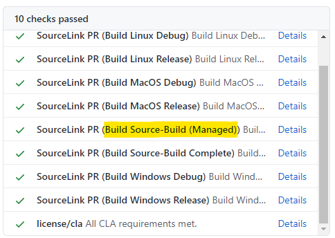

# Onboarding a repository to source build

This document describes the overall process of onboarding repos onto source build.

## Source Build Configuration

### Trying it out locally

If a repo passes build options through to the common arcade build script, a source build can be triggered via the following command.

```bash
./build.sh -sb
```

> Note: [source build is only supported on linux](https://github.com/dotnet/source-build/?tab=readme-ov-file#support).

### Excluding platform-specific components

See the [platform-specific components guidelines](./build-info.md#platform-specific-components) for guidance on excluding components based on platform requirements rather than source-build specific reasons.

## Setup CI

**Repository-level source build CI legs are optional.**
Consider adding them only if your repository has many source-build specific conditions or complex source-build scenarios.
If you have a lot of source-build specific conditions, this is when you should consider adding repo-level CI legs.

Source build CI can be activated with a single flag in the ordinary Arcade SDK jobs template for easy consumption.
If a repo can't simply use the Arcade SDK jobs template, more granular templates are also available.

See <https://github.com/dotnet/arcade/tree/main/eng/common/templates> for the current template source code.
The inline comments in the `parameters:` section in those files are the most up to date docs, maintained with higher priority than this general onboarding doc.

### `eng/common/templates/jobs/jobs.yml` opt-in switch

The simplest way to onboard. This approach applies if the repo already uses the
`eng/common/templates/jobs/jobs.yml` template.

To opt in:

Set `enableSourceBuild: true` in the template parameters.

This should look something like [this sourcelink
implementation:](https://github.com/dotnet/sourcelink/blob/dfe619dc722be42d475595c755c958afe6177554/azure-pipelines.yml#L40)

```yaml
stages:
- stage: build
displayName: Build
jobs:
- template: /eng/common/templates/jobs/jobs.yml
    parameters:
    enablePublishUsingPipelines: true
    enablePublishBuildArtifacts: true
    enablePublishBuildAssets: true
    enableSourceBuild: true
    artifacts:
        publish:
        artifacts: true
        manifests: true
```

#### End result

Submit the changes above in a PR and include
[@source-build](https://github.com/orgs/dotnet/teams/source-build)
as a reviewer. The jobs (or job, if managed-only) are automatically be added to
CI in the existing pipeline alongside existing jobs, with a name like `Build
Source-Build (<Platform>)`:



Once this PR works, run a mock official build (AKA "validation build") in your
official build definition. The usual workflow is to push a
`dev/<your-alias>/<branch-name>` branch to the AzDO repo and then queue a build
on that branch. This makes sure that merging the PR won't immediately break the
official build: `enableSourceBuild: true` does add job(s) to the official build,
not just PR validation.

If the PR is green, but merging it produces red PR or Official builds,
immediately let the source build team know about the failure and revert the
source build PR to unblock dev work.

### Advanced: granular templates

If the repo doesn't use the basic Arcade jobs template, or has advanced job
templating infra built on top of the Arcade jobs template, the simple
`enableSourceBuild` flag might not work out. There are a few more granular
templates to use in this case.

Look at the documentation in each YAML file itself to figure out how to use it
properly, and if it fits the scenario. This list is only an overview.

#### `eng/common/templates/jobs/source-build.yml`

This is one level deeper than `eng/common/templates/jobs/jobs.yml`. It is a
`jobs` template that produces just the set of source build jobs based on the
specified `platforms`. Or, just one job with the default platform, if
managed-only.

#### `eng/common/templates/job/source-build.yml`

This template defines a single `job` that runs source build on a
specifiedplatform.

#### `eng/common/templates/steps/source-build.yml`

This template defines the build `steps` for a single source build job. This is
the most granular template, and may be useful if some repo-specific preamble or
cleanup steps are required, or if the repo already has job matrix templates and
this just happens to fit in nicely.

## Source build repos and the VMR

In order to fully onboard a repo into source build, the repo must be included within the VMR. The [Repository Onboarding Guide](https://github.com/dotnet/dotnet/blob/main/docs/Repository-Onboarding.md) contains the comprehensive VMR onboarding guidance which includes among several other topics, resolving source build prebuilts.
