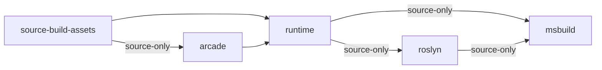
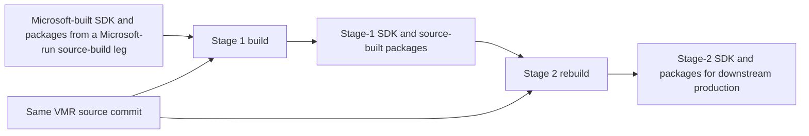

# Understanding .NET Source-Build: Why It Exists and How It Works

Source-build is the process for turning the public .NET source into a complete,
compatible .NET SDK under downstream-friendly constraints: a controlled
bootstrap chain, limited or no network access during the product build, and an
accounted-for origin for binary inputs and outputs.

The guide describes the current development model and the centralized prebuilt
detection used by the current Virtual Monolithic Repository (VMR) source-build.
Older release branches can differ, so use the documentation and implementation
on the branch being changed when servicing an older release.

## Contents

1. [What source-build is for](#1-what-source-build-is-for)
2. [The mental model](#2-the-mental-model)
3. [The repository map](#3-the-repository-map)
4. [VMR prerequisites](#4-vmr-prerequisites)
5. [The build from start to finish](#5-the-build-from-start-to-finish)
6. [Dependency provenance](#6-dependency-provenance)
7. [Build order and package-version lifting](#7-build-order-and-package-version-lifting)
8. [The three complementary leak controls](#8-the-three-complementary-leak-controls)
9. [Sequential and bootstrap source-build workflows](#9-sequential-and-bootstrap-source-build-workflows)
10. [Validation and CI](#10-validation-and-ci)
11. [Glossary](#11-glossary)
12. [Authoritative references](#12-authoritative-references)

## 1. What source-build is for

### The problem source-build solves

A normal repository build primarily answers:

> Can this repository build and pass its tests in its normal development
> environment?

Source-build asks a different, product-level question:

> Can an organization outside Microsoft start with a coherent public source
> state and explicitly permitted bootstrap inputs, build a compatible .NET SDK
> under its own platform and packaging rules, and account for the binary content
> involved?

That distinction is the foundation for the rest of this guide. Most .NET
repositories normally restore tools and packages from online feeds, and most
need an existing .NET SDK to build. Those defaults are productive for component
development but can hide dependencies that a downstream builder cannot use,
redistribute, audit, or reproduce. Source-build makes that downstream contract
testable across the whole product. See the
[source-build goals](../README.md#source-build-goals),
[infrastructure summary](../README.md#what-does-the-source-build-infrastructure-do),
and [Unified Build scenarios][build-controls].

### Who uses source-build

<!-- markdownlint-disable MD013 -->

| User | What source-build gives them |
|---|---|
| **Linux distribution and package maintainers** | A supported path for producing .NET under distribution rules that commonly restrict network access, require source availability, and require explicit treatment of binary inputs. They can apply distribution patches, choose permitted system libraries, and package the result through their own release process. |
| **.NET product engineers and CI owners** | A way to detect upstream changes that compile in ordinary repository CI but break the downstream source-build contract when the full product graph is assembled. |
| **New platform and architecture maintainers** | A bootstrap path for bringing .NET to a target that may not yet have a Microsoft-produced SDK or runtime package. |

<!-- markdownlint-enable MD013 -->

The current supported product source-build path is Linux. The
[source-build repository](../README.md#net-in-linux-distributions) lists
distributions and package systems that build or package .NET, while the
[build controls][build-controls] explicitly include both partner builds and
developer/CI validation of partner scenarios.

When a source-build check fails, the downstream consequence is concrete: a
distribution maintainer may be unable to build or service .NET from the public
source state, or may produce packages containing implementation binaries whose
origin is not acceptable or explainable under distribution policy.

### Why it matters

Source-build protects several properties that are easy to lose in a large,
multi-repository product:

1. **Downstream independence.** A distribution should be able to build and
   service .NET from public source without depending on a private Microsoft
   build or feed for each update.
2. **Provenance and auditability.** A package labeled as source-built should not
   silently contain implementation binaries copied from a Microsoft-built or
   otherwise unapproved package.
3. **Patchability.** If downstream maintainers need to apply a security,
   compatibility, or platform fix, the relevant implementation must be present
   as source or supplied through an explicit platform dependency.
4. **Build closure.** The checked-in source graph, approved bootstrap inputs, and
   declared platform toolchain should be sufficient. An online restore must not
   conceal a missing source dependency.
5. **Whole-product coherence.** Runtime, SDK, compiler, build engine, ASP.NET
   Core, and the rest of the stack must be tested as one coordinated source
   state, not only as separate repositories that each pass their own CI.
6. **Reproducibility.** Repeating a controlled build of the same source should
   not change the SDK's file contents. Stable output makes independent comparison
   practical and exposes unexplained differences caused by nondeterminism or
   uncontrolled inputs.
7. **License transparency.** Downstream redistributors need relevant source and
   build-time code to satisfy their open-source licensing policies. Code can be
   technically buildable yet unsuitable for distribution because of its license,
   so license changes must be detected and reviewed before release.

These are practical distribution concerns, not an abstract preference for
compiling locally. They are why source-build treats package provenance,
bootstrap continuity, offline behavior, final artifact contents,
reproducibility, and OSS license usage as separate validation dimensions.

### "Built from source" does not mean "no binary ever ran"

.NET is self-hosting: an SDK and compiler are needed to build the next SDK and
compiler. On a 1xx branch, the first source-build pass therefore begins with
bounded bootstrap inputs: a Microsoft-built SDK/toolset and package artifacts
produced by an earlier source-build leg run by Microsoft. They exist before the
current source is built and are inputs to, not outputs of, that source-build
invocation. Non-1xx branches instead use the matching 1xx source-built SDK and
shared components, as explained in Section 9. Native compilers, system
libraries, and a small set of policy-approved binary assets can also be
external to the VMR build.

The source-build guarantee is not that the machine began with zero binaries.
It is that:

- bootstrap inputs are explicit and have an understood purpose;
- product package dependencies have an accepted source or reference origin;
- bootstrap implementation binaries do not silently become shipping output;
- binary files in the source layout are explicitly allowed or removed; and
- the resulting SDK is compatible with the corresponding .NET product, though
  downstream branding, signing, system libraries, and packaging can differ.

Source-build also does not replace repository unit and component testing. It
validates a product construction and provenance contract; repository tests
validate component behavior.

### What source-build validates

Source-build turns the downstream properties above into separate, complementary
checks. Two workflow shapes in the validation map need a brief orientation:

- A **sequential build** performs one build using suitable SDK and package
  artifacts from an earlier source-build. N-1 to N is the common
  version-to-version relationship for ongoing servicing.
- A **bootstrap process** performs two builds when no suitable source-built
  baseline exists. Stage 1 uses a Microsoft-built SDK and package outputs from
  an earlier Microsoft-run source-build leg; stage 2 rebuilds the same source
  using the SDK and packages produced by stage 1.

The full bootstrap model, including the same-major and preview support
boundaries, is explained in
[Section 9](#9-sequential-and-bootstrap-source-build-workflows). For now, the
important point is that the validations answer different questions:

<!-- markdownlint-disable MD013 -->

| Validation | What it proves | Why a downstream builder cares |
|---|---|---|
| **Coherent VMR source and repository graph** | One source state contains the mapped product sources and orders producers before consumers. | A downstream should not have to reconstruct a hidden sequence of repository commits and package updates. |
| **Sequential upgrade path (N-1)** | The current SDK (N) can be built with the prior source-built SDK/toolset expected to bootstrap it. | A distribution can advance from its existing source-built package instead of requiring a current Microsoft-built SDK for every update. |
| **Offline restore/build** | All build inputs can explicitly be provided up front. | Restricted build systems remain usable, and network access cannot hide an undeclared dependency. |
| **Prebuilt package detection** | Every restored package came from current source-built outputs or an explicitly accepted origin. | A complete source path for build-only dependencies lets downstream builders independently reconstruct and audit how the product was produced, not only inspect what ships. |
| **Poison/leak detection** | Checked final artifacts contain no unexpected implementation content from bootstrap inputs tracked for leak detection. | A build may legitimately execute bootstrap code, but shipping that implementation can prevent a fix in current source from reaching the packaged binary, undermining downstream serviceability. |
| **Binary policy** | Every binary retained for source-build is explicitly permitted by the source-build allowlist and no unexpected binary was introduced. | Downstream packaging policies require binary inputs to be explainable and explicitly permitted. |
| **Bootstrap self-hosting** | Newly source-built SDK and package outputs are complete enough to rebuild the same source without capabilities supplied only by Microsoft-produced bootstrap inputs. | A downstream can establish a source-built baseline without depending indefinitely on Microsoft-produced bootstrap inputs. |
| **SDK reproducibility** | Two controlled source-only builds of the same VMR commit produce matching contents inside their SDK tarballs. | Downstream builders can compare independently produced SDK content, investigate unexplained divergence, and strengthen supply-chain verification and auditing. |
| **OSS license usage** | No unreviewed license detection has been introduced into relevant VMR source; detections must match an accepted OSS expression, a justified exclusion, or a reviewed baseline. | Linux distributions require relevant source and build-time code to use permitted OSS licenses. |
| **Source archive build** | Build is executed in the scope of a VMR source tree outside the context of a git repo. | Partner builds depend on source tarballs, not git repositories. |
| **System-library build** | Build is executed using selected distribution-provided native libraries. | Linux packaging policies commonly require bundled native dependencies to be replaced by separately packaged system libraries, keeping dependency ownership and security servicing in the distribution. |

<!-- markdownlint-enable MD013 -->

The [bootstrapping guidelines](bootstrapping-guidelines.md),
[source-build CI matrix][source-build-stages], and
[permissible source policy][permissible-sources] provide the implementation and
policy basis for these validations. The
[Debian policy on embedded code copies][debian-embedded-code] illustrates the
system-library requirement: when a library is already packaged by the
distribution, dependent packages should use it instead of a bundled convenience
copy.

## 2. The mental model

### Source-build, the Microsoft build, the VMR, and Unified Build are related but different

<!-- markdownlint-disable MD013 -->

| Term | Meaning |
|---|---|
| **Source-build** | A build methodology and VMR build mode intended to construct .NET from source with controlled bootstrap inputs and without online package sources. In the VMR, `-sb`, `-so`, `--source-build`, and `--source-only` all set `DotNetBuildSourceOnly=true`. |
| **Microsoft build** | Microsoft's full-product build of the VMR without the source-build switch: `DotNetBuildSourceOnly` is not `true`. This scenario can use the external services and prebuilt binary inputs permitted by Microsoft's product-construction requirements. |
| **VMR** | The Virtual Monolithic Repository, [`dotnet/dotnet`][dotnet-repo]. It is a source projection of the repositories that make up .NET plus the orchestration needed to build them together. |
| **Unified Build** | The broader .NET construction model in which one coherent VMR source state is built as a product rather than assembling independent official repository builds. |
| **Product repository** | A development repository such as `dotnet/runtime`, `dotnet/roslyn`, or `dotnet/sdk` whose selected sources are synchronized into the VMR. |

<!-- markdownlint-enable MD013 -->

The VMR is the source and orchestration location. Unified Build is the model for
constructing one product from that VMR. The Microsoft build and source-build are
different product-construction scenarios over it. Source-build is selected by
`DotNetBuildSourceOnly=true`, normally through one of the source-build command
line aliases; the Microsoft build does not select that mode.

Do not confuse a **Microsoft build** with source-build **stage 1**. Stage 1 still
runs with the source-build switch and validations. In the standard 1xx
bootstrap process, its bootstrap SDK is an output of the Microsoft-build
scenario, while its PSB package archive is an output of an earlier source-build
leg run by Microsoft. The inputs have different origins even though Microsoft
produces both. The
[build controls][build-controls] and [`build.sh`][vmr-build-script] are the
executable definitions.

### Six invariants explain most design decisions

1. **One commit describes one coherent source state.** The VMR contains copied
   source, synchronization metadata, and the root build graph needed to
   construct the product. It is not a collection of Git submodules. See the
   [VMR design][vmr-design] and [source synchronization design][vmr-codeflow].
2. **The product build can run without online package sources.** Preparation
   acquires a bounded set of bootstrap inputs first; an offline build then
   removes internet package and audit sources from each repository's NuGet
   configuration. See [`prep-source-build.sh`][prep-script] and
   [NuGet configuration rewriting][repo-targets].
3. **Every restored package needs an understood origin.** It should come from
   the current VMR build, an approved bootstrap source, or Source Build Assets.
   Other restored packages are reported as prebuilts by
   [`eng/finish-source-only.proj`][finish-source-only].
4. **Bootstrap binaries may help build the product but must not silently become
   the product.** Package poisoning marks and records selected bootstrap inputs,
   then checks final SDK and shipping artifacts for matches. See
   [`eng/init-poison.proj`][init-poison] and
   [`eng/PublishSourceBuild.props`][publish-source-build].
5. **Build order is dependency order.** A repository can consume packages
   produced by repositories that completed earlier in its dependency graph.
   The graph is expressed by `RepositoryReference` items under
   `repo-projects/`, not by directory or file name order. Independent graph
   nodes can build in parallel. See the [repository project defaults][repo-props]
   and [repository graph targets][repo-targets].
6. **Source-build divergence should be narrow.** Prefer conditions that describe
   the real platform or capability limitation. Use
   `DotNetBuildSourceOnly` only when the behavior is intrinsically specific to
   source-build. See [source-build condition guidance](sourcebuild-in-repos/build-info.md).

## 3. The repository map

There is no single "source-build repository" that owns every part of the
system.

<!-- markdownlint-disable MD013 -->

| Repository | Role | Start here when... |
|---|---|---|
| [`dotnet/source-build`][source-build-repo] | Public source-build documentation, issue tracking, and cross-repository guidance. It does not contain the current product build. | You need concepts, policy, or a place to track a cross-cutting source-build problem. |
| [`dotnet/dotnet`][dotnet-repo] | The VMR and executable source of truth for the current full product build. | You need build orchestration, source mappings, repository graph, package flow, validation, or CI. |
| [`dotnet/source-build-assets`][sba-repo] | Source, tools, and infrastructure for external, reference, targeting, and text-only packages needed by source-build. | A required package cannot be produced by a normal product repository. |
| [`dotnet/arcade`][arcade-repo] | Shared repository engineering, Arcade SDK behavior, and the template used to validate product-repository changes in VMR context. | A source-build behavior is shared by Arcade-enabled repositories or a repository needs VMR validation. |

<!-- markdownlint-enable MD013 -->

The historical name `source-build-reference-packages` still appears in some
identifiers. The current repository and VMR directory are named
`source-build-assets`, but reference assemblies intentionally retain the
metadata value `source-build-reference-packages` so leak detection can identify
them. See the [Source Build Assets README][sba-readme] and
[assembly metadata source][sba-metadata].

## 4. VMR prerequisites

The VMR's source layout, mappings, manifest, repository-inclusion rules, and
codeflow mechanisms are all Unified Build concepts that are helpful to
understand in the context of source-build. Before continuing, use these
documents as the authoritative introductions:

- [VMR Design and Operation][vmr-design] explains the source layout, mappings,
  manifest, and repository-inclusion model.
- [Full VMR Code Flow][vmr-codeflow] explains the synchronization model,
  terminology, and conflict handling.
- [Codeflow PRs][codeflow-prs] explains current policy and review expectations
  for source changes synchronized between product repositories and the VMR.

This guide refers to those concepts only where they implement source-build
behavior.

## 5. The build from start to finish

For orientation, the standard entry points are:

```bash
./prep-source-build.sh
./build.sh --source-only
```

See [system requirements](system-requirements.md) for supported hosts and
resource prerequisites.

### Phase 1: Prepare bounded bootstrap inputs

[`prep-source-build.sh`][prep-script]:

1. acquires or accepts a bootstrap .NET SDK;
2. downloads [previously source-built artifacts](#what-psb-artifacts-are);
3. on [non-1xx feature-band branches](feature-band-source-building.md),
   downloads the matching 1xx source-built SDK and shared-component artifacts;
   and
4. removes binaries that are not permitted by
   `eng/allowed-sb-binaries.txt`.

Feature bands are SDK version families such as `10.0.1xx` and `10.0.2xx`. The
1xx branch contains the shared-component sources whose outputs are consumed by
non-1xx branches. [Section 9](#9-sequential-and-bootstrap-source-build-workflows)
covers this branch layout in more detail.

The prep script can use the network. An **offline build** means the prepared build
does not use online package or audit sources; it does not mean the prep script
can obtain missing bootstrap archives without a network or a pre-populated
cache. The [bootstrapping guidelines](bootstrapping-guidelines.md) describe how
to provide the SDK and package inputs explicitly.

The prep infrastructure also retains a legacy prebuilt-archive path for
temporary preview bring-up. It is not part of the normal source-build workflow.

### Phase 2: Select source-only behavior and package-source mode

[`build.sh`][vmr-build-script] maps the source-build aliases to
`DotNetBuildSourceOnly=true` and invokes the root build. Other command-line
options configure that invocation: `--online` enables online feeds, `--poison`
enables poison checks, `--with-sdk <DIR>` selects a supplied bootstrap SDK, and
`--rid <RID>` sets the target runtime identifier. See the
[VMR build controls][build-controls] for the underlying control model.

Online and offline are package-source modes that apply independently of the
bootstrap SDK, sequential/bootstrap workflow, or stage:

<!-- markdownlint-disable MD013 -->

| Mode | Package-source behavior | Purpose |
|---|---|---|
| **Online** | Retains configured remote package sources. | Lets restores complete so centralized prebuilt detection can provide a holistic view of the unapproved packages used across the VMR and where they were used. Online access does not make those packages acceptable or relax prebuilt validation. |
| **Offline** | Removes online package and audit sources and restores from prepared local inputs. | Proves that the declared source-build inputs close the package graph without network access, as required by downstream builders. Restore stops at the first required package missing from the local inputs, before final prebuilt detection can report the complete set. |

<!-- markdownlint-enable MD013 -->

For example, if several repositories request unapproved packages available only
from remote feeds, an online build can restore them and aggregate their usage in
the final prebuilt reports. An offline build instead fails on the first restore
that cannot find one of those packages locally; after that dependency is fixed,
the next missing package may be exposed. Comparing the results distinguishes a
missing source-build input from later compile or product-composition failures.

### Phase 3: Run the root orchestration

[`build.proj`][root-build] initializes the build, validates or cleans inputs as
required, invokes the repository graph, and runs source-only finishing. Root
publishing, artifact-archive, and poison targets run later through
[`eng/PublishSourceBuild.props`][publish-source-build]. The root does not
replace each repository's build system. Instead, a
`repo-projects/<repo>.proj` adapter normally invokes that repository's own
`build.sh`, `build.cmd`, or `eng/common/build` entry point with VMR-calculated
arguments. See the [shared repository defaults][repo-props].

### Phase 4: Prepare each repository's inputs

Before a repository builds, the VMR orchestration:

- resolves its transitive `RepositoryReference` graph;
- creates generated package-version property files;
- copies and rewrites its NuGet configuration;
- adds local feeds for relevant earlier repository outputs and approved
  bootstrap/reference inputs;
- removes blocked package and audit sources for offline builds;
- updates SDK overrides and, where applicable, `global.json`; and
- gives the repository a private NuGet package cache under its own
  `src/<repo>/artifacts/` directory.

The implementation is in
[`repo-projects/Directory.Build.targets`][repo-targets] and
[`repo-projects/Directory.Build.props`][repo-props].

### Phase 5: Build the repository graph

Each repository restores and builds using its rewritten inputs. Packages from a
completed graph dependency become local sources for consumers. Independent
repositories can build concurrently, but a consumer does not build before its
declared producer dependencies.

This subset of the current graph illustrates the ordering. An arrow points from
a producer to a consumer; a `source-only` label means the dependency applies
only in source-only mode.



This is an example, not a complete or permanently fixed build order. The
[`arcade.proj`][arcade-project], [`runtime.proj`][runtime-project],
[`roslyn.proj`][roslyn-project], and [`msbuild.proj`][msbuild-project] files are
the current authority.

### Phase 6: Validate the completed source-only build

[`eng/finish-source-only.proj`][finish-source-only] aggregates package usage,
writes prebuilt reports, and errors when unapproved prebuilt package usage is
present unless a diagnostic bypass is explicitly enabled. Optional poisoning
produces a separate final-artifact report. Binary-policy validation is a third,
independent check.

### Phase 7: Inspect outputs

The most useful paths are:

| Path | Contents |
|---|---|
| `artifacts/assets/<Configuration>/` | SDK, runtime, symbols, source, and source-built artifact archives selected for the build. |
| `artifacts/packages/<Configuration>/Shipping/<repo>/` | Shipping packages produced by a repository. |
| `artifacts/packages/<Configuration>/NonShipping/<repo>/` | Non-shipping and intermediate packages produced by a repository. |
| `artifacts/log/<Configuration>/<repo>/` | Repository logs, binlogs, and repository-scoped usage data. |
| `artifacts/log/<Configuration>/prebuilt-usage.xml` | Aggregated unapproved prebuilt usages. |
| `artifacts/log/<Configuration>/poison-usage.xml` | Matches found in poison-enabled final-artifact inspection. |
| `artifacts/log/<Configuration>/binary-report/NewBinaries.txt` | Binaries not covered by the selected allowlist. |

The exact path properties are centralized in
[`eng/VmrLayout.props`][vmr-layout] and the
[repository project defaults][repo-props].

For downstream use of these outputs, see
[packaging and installation](packaging-installation.md). For the SDK's source,
symbol, and diagnostics artifacts, see
[debugging support](debugging-support.md).

## 6. Dependency provenance

The central source-build question is not only "which package version restored?"
It is "where did that package come from, and is it valid for this use?"

<!-- markdownlint-disable MD013 -->

| Origin | What it contains | Intended use | Important constraint |
|---|---|---|---|
| **Current source-built** | Packages produced by graph dependencies earlier in this VMR build. | Normal inputs to downstream repositories. | The producer must be in the graph before the consumer, and the consumer must request the produced version. |
| **Previously source-built (PSB)** | Executable packages and SDK inputs produced by an earlier source-build. | Break bootstrap cycles and provide tools before their current sources have built. | They are bootstrap inputs, not permission for old binaries to leak into final shipping output. |
| **Shared components** | Packages and SDK inputs built from the 1xx VMR branch. | Supply shared components to non-1xx feature-band builds. | They must not incorrectly override a package produced by the current band build. |
| **SBA external repository** | Source from a repository outside the `dotnet` organization, plus the projects and patches needed to build its packages. | Produce executable dependencies that are not owned by an ordinary .NET product repository. | The package implementation must be built from the included source. |
| **SBA reference or targeting package** | API signatures without the original implementation, either individually or bundled for a TFM. | Satisfy a compile-time dependency on a specific API or targeting surface. | Must not leak into SDK output. |
| **SBA text-only package** | Text assets. | Supply non-code content not produced by an ordinary product repository. | It does not provide executable code. |
| **Prebuilt** | A restored package not recognized as a current/approved source-built or reference input. | It has no intended use in a normal source-build; temporary preview-phase emergency inputs can make one available long enough to diagnose and remove the dependency. | Its use is reported and fails final prebuilt validation unless explicitly bypassed for diagnosis. |

<!-- markdownlint-enable MD013 -->

The [Source Build Assets README][sba-readme] is authoritative for its package
categories. The [prep script][prep-script], [NuGet rewrite targets][repo-targets],
and [finish target][finish-source-only] define how the VMR exposes and classifies
the corresponding feeds. The
[package dependency flow guide](package-dependency-flow.md) gives a
repository-owner view of current, previous, and reference package origins.

### Reference and targeting packages must not leak into SDK output

An SBA reference package contains API signatures without the original
implementation; an SBA targeting package bundles reference packages for a TFM.
They can satisfy compilation against an older or external API surface, but
neither package type, nor its SBA-provided reference assemblies, may leak into
SDK output. Poisoning marks input packages, and SBA reference assemblies carry
an additional source-build metadata marker. Final inspection recognizes both
kinds of markers. See [leak detection](leak-detection.md), the
[SBA README][sba-readme], [metadata source][sba-metadata], and
[poison checker][check-for-poison].

If production code executes a dependency as opposed to having just a compilation
dependency, an SBA reference or targeting package is not a solution. The
implementation must be produced from source, supplied by the platform, or the
dependency must be removed or restructured.

### Choosing an origin for a new dependency

Use this decision order:

1. **Can an existing VMR repository produce it?** Add or correct the repository
   graph and version flow.
2. **Is it an external implementation required at runtime or build time?**
   Integrate its source through the Source Build Assets external-package
   mechanism.
3. **Is only an API or TFM targeting surface needed at compile time?** Consider
   an SBA reference or targeting package.
4. **Is it only text content?** Use an SBA text-only package.
5. **Can the dependency be removed or replaced by a framework/platform
   facility?** Prefer reducing the bootstrap surface.

The detailed contribution process lives in
[adding new dependencies](sourcebuild-in-repos/new-dependencies.md) and the
[Source Build Assets README][sba-readme].

## 7. Build order and package-version lifting

Package availability has two independent requirements:

1. the package must exist in a feed visible to the consumer; and
2. the consumer must request a version that feed can satisfy.

Fixing only one frequently leaves a prebuilt or restore failure.

### Build order comes from `RepositoryReference`

`RepositoryReference` items in `repo-projects/*.proj` become MSBuild project
references. Their transitive graph controls which repository outputs are
available to a consumer. If repository B consumes a package produced by
repository A, B needs a graph path to A. Adding a package version property
without fixing this graph does not make A build first. See the
[repository graph implementation][repo-targets]. In general, the repo
dependency graph is stable and should not be changed without a very good
reason.

### The VMR lifts package versions into each repository

**Version lifting** means overriding a repository's default package versions
with versions available from the VMR build inputs. This makes a consumer
request a current source-built or approved bootstrap package instead of an
incompatible version pinned in its synchronized sources.

Before each repository build, `CreateBuildInputProps` writes these
repository-specific files:

- `PackageVersions.<repo>.Current.props` for packages produced by graph
  dependencies in the current build;
- `PackageVersions.<repo>.Previous.props` for previously source-built inputs;
- `PackageVersions.<repo>.SharedComponents.props` for 1xx shared-component
  inputs (only applicable to non-1xx branches);
- `PackageVersions.<repo>.Snapshot.props`, an unfiltered current-package
  snapshot used to attribute produced packages; and
- `PackageVersions.<repo>.props`, which imports the applicable input files.

Together, these files form a consumer-specific set of version overrides. The
VMR uses the consumer's declared dependency metadata to choose which current,
previous, or shared-component versions replace repository defaults. It does not
treat every package available in a feed as an override.

**Example: lifting MSBuild's Roslyn compiler dependency.** MSBuild's
[Darc-generated dependency properties][msbuild-version-details] initially set
its compiler toolset version. Using
[released compiler-toolset versions][compiler-toolset-package] to illustrate
the relationship rather than values from a particular build:

```xml
<MicrosoftNetCompilersToolsetPackageVersion>4.13.0</MicrosoftNetCompilersToolsetPackageVersion>
<MicrosoftNetCompilersToolsetVersion>$(MicrosoftNetCompilersToolsetPackageVersion)</MicrosoftNetCompilersToolsetVersion>
```

MSBuild uses `MicrosoftNetCompilersToolsetVersion` for its
[`Microsoft.Net.Compilers.Toolset` package dependency][msbuild-package-versions].

```xml
<!-- PackageVersions.msbuild.Previous.props -->
<MicrosoftNetCompilersToolsetVersion>4.12.0</MicrosoftNetCompilersToolsetVersion>
<MicrosoftNetCompilersToolsetPackageVersion>4.12.0</MicrosoftNetCompilersToolsetPackageVersion>

<!-- PackageVersions.msbuild.Current.props -->
<MicrosoftNetCompilersToolsetVersion>4.14.0</MicrosoftNetCompilersToolsetVersion>
<MicrosoftNetCompilersToolsetPackageVersion>4.14.0</MicrosoftNetCompilersToolsetPackageVersion>
```

`PackageVersions.msbuild.props` imports the previous file first and the current
file second. The combined overrides are applied after MSBuild's repository
defaults, so `4.14.0` wins. MSBuild therefore consumes the compiler toolset
produced by the current Roslyn build rather than its Darc-pinned version or the
previously source-built version.

See [package dependency flow](package-dependency-flow.md) for a worked
description of current and previous package-version props and the metadata that
enables lifting.

This yields an important debugging rule:

> A package can exist in a current source-built feed and still restore the wrong
> version if the consumer does not declare the dependency metadata used for
> version lifting.

### Dependency metadata must stay aligned

A package update changes a relationship between a consumer and a producer, not
just a version number. Version lifting works only when the VMR can connect all
of these facts:

| Surface | What it tells the build |
|---|---|
| The consumer's package reference and `eng/Versions.props` | Which package and version property the consumer uses. |
| `eng/Version.Details.xml` | Which dependency the property represents and which repository produces it. |
| The VMR `RepositoryReference` graph | Whether that producer's current packages are available before the consumer builds. |
| The producer's package outputs | The package ID and version that are actually available to restore. |

These surfaces therefore need to change together. For example, changing
`Versions.props` without the corresponding `Version.Details.xml` update leaves
the repository's normal build and its Darc/VMR dependency declaration out of
sync. Renaming or splitting a producer package without moving every consumer can
be even harder to notice: an older copy in the previously source-built archive
may let one release build, then the next release fails after that copy ages out.

When reviewing a dependency update, verify the consumer metadata, producer
output, and VMR graph as one change. Keep an older SBA or bootstrap package
available until every consumer has moved. Prefer Darc for dependency updates
because it updates `Versions.props` and `Version.Details.xml` together. See
[updating dependencies](sourcebuild-in-repos/update-dependencies.md) for these
coordination failures.

## 8. The three complementary leak controls

Prebuilt detection, poisoning, and binary policy answer different questions.
The first two both deal with binary dependencies, but they inspect different
boundaries:

| Control | What it inspects | Question it answers |
|---|---|---|
| **Prebuilt detection** | The NuGet restore graphs used to perform the build. | Did every restored package come from current source-built output or another explicitly accepted source-build origin? |
| **Poisoning** | Selected final SDK and shipping artifacts after the build. | Did implementation content from a bootstrap input tracked for leak detection survive into output where it was not expected? |

The simplest rule is:

> Permission to use a bootstrap input during the build is not permission to ship
> that input in the product.

The possible outcomes make the distinction clearer:

<!-- markdownlint-disable MD013 -->

| Situation | What happens |
|---|---|
| A required package is unavailable from every offline source. | Restore fails before either report can classify the dependency. |
| An unapproved package is available from a prepared local feed or package cache and is used only during the build. | Offline restore can succeed, but prebuilt detection fails because local availability does not make the package's origin acceptable. Poisoning can remain clean because the package did not ship. |
| An accepted [previously source-built (PSB) package](#what-psb-artifacts-are) supplies a tool that runs during the build, and none of that tool's implementation reaches checked output. | Its bootstrap use is allowed; neither check reports a violation. |
| An assembly from a bootstrap input marked for poison detection is copied or repackaged into checked final output. | Poisoning reports the leak even if the package itself was an accepted bootstrap input. |

<!-- markdownlint-enable MD013 -->

Prebuilt detection therefore asks **where the build's packages came from**.
Poisoning asks **what bootstrap implementation survived into the result**.
Source-build needs both because they protect related but distinct properties.
**Reconstructibility** means a downstream can account for and reproduce how the
product was made from available source and declared inputs; build-only
dependencies are part of that history even when they do not ship.
**Serviceability** means a downstream can change the source corresponding to
each shipped implementation and rebuild the product so the fix reaches the
output. A poison leak undermines serviceability because rebuilding current
source can simply copy or repackage the same bootstrap implementation, leaving
a current-source fix out of the shipped binary. Poisoning examines output
contents because package-origin checks alone can miss that leak after copying,
repackaging, or renaming. See
[package dependency flow](package-dependency-flow.md),
[eliminating prebuilts](eliminating-pre-builts.md),
[leak detection](leak-detection.md), and the
[poison report format](poison-report-format.md).

### 8.1 Prebuilt package detection: what did restore use?

The VMR archives repository restore data and
[`WritePackageUsageData`][package-usage-task] compares restored packages with
known current source-built, previously source-built, shared-component, and
reference package inputs. The finish target writes:

- `prebuilt-usage.xml`, the package usages classified as prebuilts; and
- `prebuilt-annotated-usage.xml`, which adds dependency context such as direct
  versus transitive use.

A prebuilt finding means the restore graph contains a package version whose
origin is not accepted by this classification.

### 8.2 Poisoning: did bootstrap implementation reach checked output?

`./build.sh -sb --poison` sets `EnablePoison=true`.
[`eng/init-poison.proj`][init-poison] invokes `MarkAndCatalogPackages` for
prebuilt packages, PSB packages, and selected shared-component tooling
packages. The task records package and file hashes and adds marker data where
applicable.

After publishing, [`eng/PublishSourceBuild.props`][publish-source-build] invokes
`CheckForPoison` over:

- the source-built SDK archive;
- shipping NuGet packages; and
- SBA reference packages.

The checker can identify hash matches, poison assembly metadata, package marker
files, and source-build reference assemblies. It writes
`poison-usage.xml`.

### 8.3 Binary policy: what binary files exist in the source layout?

The binary tool scans files independently of NuGet package provenance.

- `eng/allowed-sb-binaries.txt` is the stricter source-build allowlist and is
  also used by prep when removing impermissible binaries.
- `eng/allowed-vmr-binaries.txt` imports the source-build allowlist and adds
  binaries permitted in other VMR build scenarios.
- Unexpected files are written to
  `artifacts/log/<Configuration>/binary-report/NewBinaries.txt` and fail binary
  validation.

See [VMR permissible sources][permissible-sources],
[`allowed-sb-binaries.txt`][allowed-sb-binaries], and
[`allowed-vmr-binaries.txt`][allowed-vmr-binaries].

An allowlist entry should express the narrowest justified policy. A binary
needed only by tests or a non-source-only build usually belongs, if permitted,
in the broader VMR allowlist rather than the source-build allowlist. The
source-only build must then tolerate its removal. Broad directory globs can
hide future unrelated binaries and should be treated as high risk.

## 9. Sequential and bootstrap source-build workflows

### Why bootstrap inputs are unavoidable

Compilers, SDKs, and build tasks are needed before their current source has
been compiled. Source-build breaks these cycles with a bounded bootstrap set,
then replaces those inputs as the graph produces current packages. Previously
source-built (PSB) inputs are artifacts from an earlier build, typically the
previous release of that .NET version.

Every source-build needs bootstrap inputs, including a sequential build that
starts from an earlier source-built SDK. In this guide, **bootstrap process**
means the special two-build workflow used to establish a suitable source-built
baseline; **sequential build** means the one-build workflow used after such a
baseline exists.

Here, *sequential* describes continuity between source-build outputs, not serial
execution of the repository graph.

Neither workflow grants a general prebuilt exception. The origin and permitted
use of every bootstrap input remain explicit and paired with validation.

### Bootstrap process: stage 1 and stage 2

The bounded bootstrap inputs solve the first-build problem, but they leave a
second question: can the SDK just built from source replace those inputs for
another build? Source-build separates the questions by building the same source
twice. These passes are called **stage 1** and **stage 2**.

The stage number identifies a **generation of build output**. Both stages build
the same VMR commit and target the same .NET SDK version. What changes is the
SDK and package set used to drive each build:

<!-- markdownlint-disable MD013 -->

| Stage | Inputs that start the build | Result and meaning |
|---|---|---|
| **Stage 1** | In the standard 1xx bootstrap process, a Microsoft-built SDK/toolset and a PSB package archive produced by an earlier source-build leg run by Microsoft. | Produces the first SDK and source-built package archive from the current source. A pass proves that these bounded bootstrap inputs can construct the product in source-build mode. |
| **Stage 2** | The SDK and source-built package archive produced by stage 1. | Rebuilds the same source revision and produces the SDK and packages that meet downstream source-build production requirements. A pass proves that current source-built outputs are complete enough to drive the build without capabilities supplied only by the original bootstrap inputs. |

<!-- markdownlint-enable MD013 -->

**Why stage 2 is significant.** Stage 2 is a real consumer test of the newly built SDK.
It uses that SDK, including its new targets, build tasks, analyzers, and defaults,
to rebuild the VMR. Stage 1 can pass while using an earlier SDK that does not
yet impose those behaviors. Stage 2 therefore often exposes breaking SDK
changes: for example, a newly included analyzer can report errors in repository
sources. The VMR source or orchestration must then be updated to meet the new SDK
requirements before the product is source-buildable. See the
[stage-2 build guide](how-to-stage2-build.md).



Stage 2 is not the next release, a later commit, or a continuation of the
partially built stage-1 tree. It is a new build of the same source that uses the
SDK and packages produced by stage 1.

Stage 1 creates the source-built bootstrap inputs needed for the second pass.
Stage 2 is the downstream production build: its inputs and outputs meet
source-build's downstream production requirements. A Linux distribution can
then apply its own branding, signing, installation layout, and
package-manager metadata without rebuilding the product with
Microsoft-produced inputs.

See the [bootstrapping guidelines](bootstrapping-guidelines.md) for the complete
bootstrap workflow and [stage-2 build guide](how-to-stage2-build.md) for a
concrete two-build example.

### What PSB artifacts are

**Previously source-built (PSB) artifacts** are the package-side bootstrap
inputs carried from an earlier source-build invocation into the current one.
The VMR publishes this input set as
`Private.SourceBuilt.Artifacts.<version>.<rid>.tar.gz`. The archive is an output
when a build creates it; it becomes **PSB** when a later build consumes it.

The current archive is more than a directory of NuGet packages:

<!-- markdownlint-disable MD013 -->

| Content | Why it is included |
|---|---|
| Source-built NuGet packages | Supply prior source-built versions when the current build cannot yet use a package it will produce later. For example, Roslyn builds before MSBuild, so Roslyn must use an earlier source-built `Microsoft.Build` package rather than the one MSBuild will produce later in the same invocation. |
| `PackageVersions.props` | Records package versions available from the archive so the next build can align repository dependencies with them. |
| Build version and asset-manifest metadata | Identify the build and assets represented by the archive. |
| Selected runtime, ASP.NET Core runtime, and complete-symbol archives | Support later product-construction and feature-band scenarios that need those build outputs. |

<!-- markdownlint-enable MD013 -->

PSB artifacts and the N-1 SDK usually come from the same source-build, but they
are separate inputs:

| Input | Role |
|---|---|
| **Previous source-built SDK** | Supplies the `dotnet` host, compiler, MSBuild, SDK resolvers, and SDK tasks that drive the build. |
| **PSB artifact archive** | Supplies NuGet packages and related build assets consumed by restore and repository build logic before the current graph can replace them. |

The PSB lifecycle is:

1. A successful source-build publishes a `Private.SourceBuilt.Artifacts`
   archive.
2. A later build selects an archive version, and
   [`prep-source-build.sh`][prep-script] downloads and extracts it under the
   previously-source-built input area. `--with-packages` can provide an already
   extracted archive instead.
3. The VMR exposes those packages through local restore sources and uses their
   version map until current repository outputs become available.
4. Prebuilt detection recognizes PSB as an accepted bootstrap origin, but
   [poisoning](leak-detection.md) tracks its implementation content to detect
   anything unexpectedly copied into checked final artifacts.

Which earlier source-build produced the PSB archive depends on the workflow:

- Stage 1 consumes an archive produced by an earlier Microsoft-run source-build
  leg.
- A sequential build consumes an archive produced by the downstream builder's
  preceding source-build release.
- Stage 2 consumes the archive produced immediately by stage 1 from the same
  source revision. It has the same format as the other PSB archives, but contains
  the current source's outputs for the self-hosting check.

PSB is also different from **shared-component artifacts**. PSB breaks bootstrap
cycles and is not redistributed as old implementation. Shared-component
artifacts carry 1xx outputs into later feature bands and can intentionally
contribute to those bands' final product. See
[package dependency flow](package-dependency-flow.md),
[bootstrapping guidelines](bootstrapping-guidelines.md),
[stage-2 builds](how-to-stage2-build.md), and the
[feature-band source-building guide](feature-band-source-building.md).

### Sequential builds protect the downstream upgrade path

Once a suitable source-built baseline exists, a **sequential build** uses its SDK
and package artifacts to produce the next release in one build. This is the
normal workflow for ongoing releases.

In source-build terminology, **N-1** is the previous SDK used to build the
current SDK, **N**. N-1 to N is the common sequential relationship for servicing:
a previously source-built SDK supplies the compiler, MSBuild, and build tasks
needed to build the next servicing SDK.

The CI job template exposes this as `withPreviousSDK`, described as using "the
previous version's SDK to build the current one." The source-build matrix
exercises it in jobs whose names contain `PreviousSourceBuiltSdk`. See the
[VMR build job template][vmr-build-job] and
[source-build leg matrix][source-build-stages].

This leg protects a downstream upgrade chain:

- current sources must not begin requiring a compiler or SDK feature available
  only in a newer Microsoft-built bootstrap;
- the previous source-built SDK and package archive must contain the tools that
  current source expects; and
- a distribution should be able to build its next package from the
  source-built SDK it already ships.

N/N-1 and stage 1/stage 2 describe different relationships:

- **N and N-1** are different SDK versions.
- **Stage 1 and stage 2** are different build generations of the *same* SDK
  version and source revision.

| Workflow/check | Starting SDK | Source being built | Question answered |
|---|---|---|---|
| **Sequential / N-1** | A prior source-built SDK from the established same-major chain. | The current N source. | Can a downstream move forward from the SDK it already built? |
| **Bootstrap / stage 2** | The current N SDK and package archive just produced by stage 1. | The same current N source that stage 1 built. | Can today's output rebuild today's source without help available only from the original bootstrap inputs? |

The bootstrap process and the sequential N-1 check are separate in the current
CI matrix. The stage-1 job begins with outputs from an earlier Microsoft-run
source-build leg, and its output feeds stage 2. The N-1 leg instead uses a
previous source-built SDK to test a sequential downstream upgrade; it does not
feed the standard stage-2 job.

The supported downstream sequential N-1 chain never crosses a major version.
.NET uses the two-stage bootstrap process when onboarding a new major. Each
pre-RC1 preview transition needs a new bootstrap process. The RC1 stage-2 output
establishes the baseline from which later sequential builds in that major can
preserve the supported N-1 chain. See the
[bootstrapping guidelines](bootstrapping-guidelines.md).

The bootstrap process uses the ordinary stage-1/stage-2 mechanism described
above; *bootstrap* describes why that two-build sequence is being run, not a
separate build mode.

That downstream support boundary and the CI check are not identical. CI can run
`PreviousSourceBuiltSdk` legs during previews with a recent source-built preview
SDK. Those legs test compatibility, but they do not remove the need to produce a
stage-2 baseline through the bootstrap process for each new preview before RC1.

### Non-1xx feature-band branches use shared components

The 1xx branch contains shared component sources. Non-1xx VMR branches contain
band-specific sources and consume shared-component outputs from the matching
1xx build. The [VMR design][vmr-design] describes the layout, while the
[prep script][prep-script] implements acquisition of the 1xx source-built SDK
and shared-components archive for non-1xx builds. The
[feature-band source-building guide](feature-band-source-building.md) explains
the downstream bootstrap and servicing workflows for each band.

### How CI performs stage 2

The current source-build pipeline implements the stage-1/stage-2 model as two
jobs:

1. A stage-1 job builds the VMR with a Microsoft-built SDK and package inputs
   produced by an earlier Microsoft-run source-build leg, then publishes the
   resulting SDK plus the `Private.SourceBuilt.Artifacts` archive.
2. A stage-2 job declares the stage-1 job in `reuseBuildArtifactsFrom`, downloads
   those outputs, and supplies the extracted SDK and packages to another build
   of the same VMR source commit.

CI routinely runs this two-job self-hosting validation even when a downstream
release can use the sequential workflow. It exercises the same stage-1/stage-2
mechanism as a bootstrap process to ensure the VMR is always in a state that
supports this scenario.

The standard job names make the input choice visible:

```text
SB_<Distro>_Online_MsftSdk_<arch>                 # stage 1
SB_<Distro>_Offline_CurrentSourceBuiltSdk_<arch>  # stage 2
```

This is wired through `reuseBuildArtifactsFrom` in the
[source-build leg matrix][source-build-stages]. A stage-1 pass proves the source
can build with the bootstrap inputs supplied by the earlier Microsoft-run
source-build leg. A stage-2 pass additionally proves that the resulting SDK and
source-built packages can drive a fresh build of the same source and produces
the outputs intended for downstream production use.

A stage-2-only failure often points to:

- VMR source or build orchestration that is incompatible with new SDK targets,
  tasks, analyzers, defaults, or other requirements;
- a build task or SDK package missing from source-built outputs;
- a tool or build task that succeeded in stage 1 by using an asset from the
  bootstrap SDK, but fails when that assembly is absent from the source-built SDK;
- an incorrect SDK override; or
- a version-lifting difference.

See [stage-2 builds](how-to-stage2-build.md).

## 10. Validation and CI

### Validate in both repository and VMR context

Repository tests answer whether the component still works in its normal
development environment. VMR validation answers whether the mapped source
works in the coherent product graph with VMR package provenance, version
lifting, and source-only constraints. Neither replaces the other.

Arcade provides `eng/common/templates/vmr-build-pr.yml` so participating
repositories can construct and validate a VMR with proposed repository
changes. The current template supports selecting source-build stage-1 or
stage-2 verification. See [VMR validation in repository PRs][vmr-validation].

### Read source-only CI names as a test matrix

The source-only stage is named `VMR_SourceOnly_Build`. Jobs use names based on
dimensions such as:

```text
SB_<Distro>_Online_MsftSdk_<arch>
SB_<Distro>_Offline_CurrentSourceBuiltSdk_<arch>
SB_<Distro>_Offline_PreviousSourceBuiltSdk_<arch>
```

The current [source-build leg matrix][source-build-stages] varies:

- online versus offline restore;
- Microsoft-produced, current source-built, or previous source-built SDK;
- distribution and architecture;
- system-library use;
- CoreCLR versus Mono scenarios;
- poisoning; and
- signing and source-artifact creation.

The [CI platform coverage guidelines](ci-platform-coverage-guidelines.md)
explain how distributions, versions, architectures, and artifact-producing legs
are selected and transitioned.

Do not treat two red `SB_` jobs as duplicate evidence until their dimensions are
compared. Conversely, one green leg does not cover dimensions that only another
leg exercises.

### License scanning guards source-policy changes

License validation runs in a [dedicated pipeline][license-scan-pipeline], not as
another dimension of every `SB_` job. The pipeline runs weekly.
It uses [ScanCode Toolkit](https://github.com/aboutcode-org/scancode-toolkit) to
scan each repository under the VMR's `src/` directory.

The validation detects license findings that are new or no longer match
reviewed source-build policy. This helps prevent source with unreviewed
licensing from silently entering the VMR. Its results are evidence for
review, not a legal determination or proof of compatibility with every
distribution's policy.

### Reproducibility compares two controlled SDK builds

The dedicated [reproducibility pipeline][repro-pipeline] builds the same VMR
commit twice under controlled conditions and compares the files inside the
resulting SDK archives. A pass demonstrates that rebuilding the same source in
the same controlled environment produces the same SDK file layout and contents,
rather than silently incorporating time-dependent or otherwise uncontrolled
inputs. This helps downstream builders investigate unexplained differences
between independently produced SDKs and strengthens supply-chain auditing. The
[tracking issue][repro-issue] explains the motivation and ongoing work.

## 11. Glossary

<!-- markdownlint-disable MD013 -->

| Term | Definition |
|---|---|
| **Bootstrap process** | The two-build workflow used when no suitable source-built baseline exists: on a 1xx branch, stage 1 builds with a Microsoft-built SDK and package outputs from an earlier Microsoft-run source-build leg, then stage 2 rebuilds the same source with stage-1 outputs and establishes the downstream baseline. |
| **Bootstrap SDK/input** | A bounded existing SDK or package input needed before the current sources can produce their own toolset. |
| **Downstream** | A distribution, package maintainer, or other consumer that builds and packages .NET from the upstream public source. |
| **License scan** | The ScanCode-based VMR source check that filters accepted OSS expressions and justified exclusions, then compares remaining detections with reviewed per-target baselines. |
| **Microsoft build** | Microsoft's full-product VMR build with `DotNetBuildSourceOnly` not set to `true`; unlike source-build, it can use the external services and binary inputs allowed by Microsoft's product-construction requirements. |
| **N / N-1** | N is the SDK being built; N-1 is the previous source-built SDK used as its bootstrap toolset in the common sequential servicing workflow. The supported downstream chain is same-major and begins from the RC1 source-built baseline; preview CI can exercise N-1 before that handoff. |
| **Poisoning** | Marking or recording selected bootstrap/prebuilt content and checking final artifacts for matching implementation files or markers. |
| **Prebuilt** | In current VMR package reporting, a restored package not accounted for by recognized source-built/bootstrap/reference inputs. |
| **Private.SourceBuilt.Artifacts** | The versioned, RID-specific archive emitted by a source-build with source-built packages, package-version data, build metadata, and selected supporting archives. It becomes a PSB input when a later build consumes it. |
| **PSB** | Previously source-built package-side bootstrap artifacts consumed through `--with-packages`. They are accepted build inputs used to break cycles, but their old implementation must not leak into checked final output. |
| **Reproducibility** | For the current SDK validation, two controlled builds of the same VMR commit produce matching regular-file paths and contents inside their SDK tarballs. This is narrower than byte-for-byte equality of the compressed tarballs. |
| **SBA** | Source Build Assets, the current repository name for external, reference, targeting, and text-only package sources. |
| **SBRP** | Source Build Reference Packages, the historical and still-common name associated with Source Build Assets. |
| **Sequential build** | A one-build workflow driven by suitable SDK and package artifacts from an earlier source-build. N-1 to N servicing is the common case, but initial later-feature-band builds can sequentially consume another band's source-built outputs. |
| **Shared components** | Current 1xx source-built outputs supplied to non-1xx feature-band builds and intentionally eligible to contribute to those bands' product output; unlike PSB, they are not merely old bootstrap implementation. |
| **Source-only/source-build** | The VMR build mode selected by `DotNetBuildSourceOnly=true`. |
| **Stage 0** | Exceptional preparation of a usable bootstrap SDK for an unsupported operating system or architecture when no compatible Microsoft-produced SDK exists; it is not the standard new-major bootstrap sequence. |
| **Stage 1** | The first build of a VMR source revision in a two-stage bootstrap process; on a 1xx branch, a Microsoft-built SDK and package outputs from an earlier Microsoft-run source-build leg drive it, and it produces the current source-built SDK and package archive. |
| **Stage 2** | A fresh rebuild of the same VMR source revision, driven by the SDK and source-built package archive produced by stage 1; its outputs meet downstream source-build production requirements. |
| **Version lifting** | VMR-generated package-version overrides that align a repository with packages available from current or approved bootstrap inputs. |

<!-- markdownlint-enable MD013 -->

## 12. Authoritative references

### Architecture and codeflow

- [VMR Design and Operation][vmr-design]
- [Full VMR Code Flow][vmr-codeflow]
- [Codeflow PRs][codeflow-prs]
- [VMR Build Controls][build-controls]

### Build implementation

- [`build.sh`][vmr-build-script]
- [`prep-source-build.sh`][prep-script]
- [`build.proj`][root-build]
- [`repo-projects/Directory.Build.props`][repo-props]
- [`repo-projects/Directory.Build.targets`][repo-targets]
- [`eng/finish-source-only.proj`][finish-source-only]
- [`eng/PublishSourceBuild.props`][publish-source-build]
- [`eng/VmrLayout.props`][vmr-layout]

### Dependencies and policy

- [Source Build Assets README][sba-readme]
- [Package dependency flow](package-dependency-flow.md)
- [MSBuild Darc-generated dependency properties][msbuild-version-details]
- [Repo owner's handbook](sourcebuild-in-repos/README.md)
- [Adding new dependencies](sourcebuild-in-repos/new-dependencies.md)
- [Updating dependencies](sourcebuild-in-repos/update-dependencies.md)
- [Considerations when adding features](sourcebuild-in-repos/adding-features.md)
- [Onboarding repositories](sourcebuild-in-repos/new-repo.md)
- [Eliminating prebuilts](eliminating-pre-builts.md)
- [VMR permissible sources][permissible-sources]
- [Debian policy on embedded code copies][debian-embedded-code]

### Validation

- [VMR validation in repository PRs][vmr-validation]
- [Source-build CI leg matrix][source-build-stages]
- [VMR license-scanning guide][license-scan-doc]
- [VMR license-scan pipeline][license-scan-pipeline]
- [OSS license scan test][license-scan-test]
- [SDK reproducibility pipeline][repro-pipeline]
- [SDK reproducibility comparison test][repro-test]
- [CI platform coverage guidelines](ci-platform-coverage-guidelines.md)
- [Bootstrapping guidelines](bootstrapping-guidelines.md)
- [Stage-2 builds](how-to-stage2-build.md)
- [Feature-band source building](feature-band-source-building.md)
- [Leak detection](leak-detection.md)
- [Poison report format](poison-report-format.md)
- [System requirements](system-requirements.md)
- [Cross-building](cross-building.md)
- [Packaging and installation](packaging-installation.md)
- [Debugging support](debugging-support.md)

[allowed-sb-binaries]: https://github.com/dotnet/dotnet/blob/9a59e4a8c37f0af10a77f95e3d8dd3cfe94a5646/eng/allowed-sb-binaries.txt
[allowed-vmr-binaries]: https://github.com/dotnet/dotnet/blob/9a59e4a8c37f0af10a77f95e3d8dd3cfe94a5646/eng/allowed-vmr-binaries.txt
[arcade-project]: https://github.com/dotnet/dotnet/blob/9a59e4a8c37f0af10a77f95e3d8dd3cfe94a5646/repo-projects/arcade.proj
[arcade-repo]: https://github.com/dotnet/arcade
[build-controls]: https://github.com/dotnet/dotnet/blob/9a59e4a8c37f0af10a77f95e3d8dd3cfe94a5646/docs/VMR-Controls.md
[check-for-poison]: https://github.com/dotnet/dotnet/blob/9a59e4a8c37f0af10a77f95e3d8dd3cfe94a5646/eng/tools/tasks/Microsoft.DotNet.SourceBuild.Tasks.LeakDetection/CheckForPoison.cs
[codeflow-prs]: https://github.com/dotnet/dotnet/blob/9a59e4a8c37f0af10a77f95e3d8dd3cfe94a5646/docs/Codeflow-PRs.md
[compiler-toolset-package]: https://www.nuget.org/packages/Microsoft.Net.Compilers.Toolset
[debian-embedded-code]: https://www.debian.org/doc/debian-policy/ch-source.html#embedded-code-copies
[dotnet-repo]: https://github.com/dotnet/dotnet
[finish-source-only]: https://github.com/dotnet/dotnet/blob/9a59e4a8c37f0af10a77f95e3d8dd3cfe94a5646/eng/finish-source-only.proj
[init-poison]: https://github.com/dotnet/dotnet/blob/9a59e4a8c37f0af10a77f95e3d8dd3cfe94a5646/eng/init-poison.proj
[license-scan-doc]: https://github.com/dotnet/dotnet/blob/9a59e4a8c37f0af10a77f95e3d8dd3cfe94a5646/docs/license-scanning.md
[license-scan-pipeline]: https://github.com/dotnet/dotnet/blob/9a59e4a8c37f0af10a77f95e3d8dd3cfe94a5646/eng/pipelines/vmr-license-scan.yml
[license-scan-test]: https://github.com/dotnet/dotnet/blob/9a59e4a8c37f0af10a77f95e3d8dd3cfe94a5646/test/Microsoft.DotNet.SourceBuild.Tests/LicenseScanTests.cs
[msbuild-package-versions]: https://github.com/dotnet/dotnet/blob/9a59e4a8c37f0af10a77f95e3d8dd3cfe94a5646/src/msbuild/Directory.Packages.props
[msbuild-project]: https://github.com/dotnet/dotnet/blob/9a59e4a8c37f0af10a77f95e3d8dd3cfe94a5646/repo-projects/msbuild.proj
[msbuild-version-details]: https://github.com/dotnet/dotnet/blob/9a59e4a8c37f0af10a77f95e3d8dd3cfe94a5646/src/msbuild/eng/Version.Details.props
[package-usage-task]: https://github.com/dotnet/dotnet/blob/9a59e4a8c37f0af10a77f95e3d8dd3cfe94a5646/eng/tools/tasks/Microsoft.DotNet.UnifiedBuild.Tasks/UsageReport/WritePackageUsageData.cs
[permissible-sources]: https://github.com/dotnet/dotnet/blob/9a59e4a8c37f0af10a77f95e3d8dd3cfe94a5646/docs/VMR-Permissible-Sources.md
[prep-script]: https://github.com/dotnet/dotnet/blob/9a59e4a8c37f0af10a77f95e3d8dd3cfe94a5646/prep-source-build.sh
[publish-source-build]: https://github.com/dotnet/dotnet/blob/9a59e4a8c37f0af10a77f95e3d8dd3cfe94a5646/eng/PublishSourceBuild.props
[repro-issue]: https://github.com/dotnet/source-build/issues/4963
[repro-pipeline]: https://github.com/dotnet/dotnet/blob/9a59e4a8c37f0af10a77f95e3d8dd3cfe94a5646/eng/pipelines/unified-build-reproducibility-tests.yml
[repro-test]: https://github.com/dotnet/dotnet/blob/9a59e4a8c37f0af10a77f95e3d8dd3cfe94a5646/test/Microsoft.DotNet.Reproducibility.Tests/ReproducibilityTests.cs
[repo-props]: https://github.com/dotnet/dotnet/blob/9a59e4a8c37f0af10a77f95e3d8dd3cfe94a5646/repo-projects/Directory.Build.props
[repo-targets]: https://github.com/dotnet/dotnet/blob/9a59e4a8c37f0af10a77f95e3d8dd3cfe94a5646/repo-projects/Directory.Build.targets
[root-build]: https://github.com/dotnet/dotnet/blob/9a59e4a8c37f0af10a77f95e3d8dd3cfe94a5646/build.proj
[roslyn-project]: https://github.com/dotnet/dotnet/blob/9a59e4a8c37f0af10a77f95e3d8dd3cfe94a5646/repo-projects/roslyn.proj
[runtime-project]: https://github.com/dotnet/dotnet/blob/9a59e4a8c37f0af10a77f95e3d8dd3cfe94a5646/repo-projects/runtime.proj
[sba-metadata]: https://github.com/dotnet/source-build-assets/blob/2fad1e8b2177078cab920a9831d847646dcc9965/src/SourceBuildAssemblyMetdata.cs
[sba-readme]: https://github.com/dotnet/source-build-assets/blob/2fad1e8b2177078cab920a9831d847646dcc9965/README.md
[sba-repo]: https://github.com/dotnet/source-build-assets
[source-build-repo]: https://github.com/dotnet/source-build
[source-build-stages]: https://github.com/dotnet/dotnet/blob/9a59e4a8c37f0af10a77f95e3d8dd3cfe94a5646/eng/pipelines/templates/stages/source-build-stages.yml
[vmr-build-script]: https://github.com/dotnet/dotnet/blob/9a59e4a8c37f0af10a77f95e3d8dd3cfe94a5646/build.sh
[vmr-build-job]: https://github.com/dotnet/dotnet/blob/9a59e4a8c37f0af10a77f95e3d8dd3cfe94a5646/eng/pipelines/templates/jobs/vmr-build.yml
[vmr-codeflow]: https://github.com/dotnet/dotnet/blob/9a59e4a8c37f0af10a77f95e3d8dd3cfe94a5646/docs/VMR-Full-Code-Flow.md
[vmr-design]: https://github.com/dotnet/dotnet/blob/9a59e4a8c37f0af10a77f95e3d8dd3cfe94a5646/docs/VMR-Design-And-Operation.md
[vmr-layout]: https://github.com/dotnet/dotnet/blob/9a59e4a8c37f0af10a77f95e3d8dd3cfe94a5646/eng/VmrLayout.props
[vmr-validation]: https://github.com/dotnet/arcade/blob/8de33a8803925a948c11efe92631bfab24958959/Documentation/VmrValidation.md
